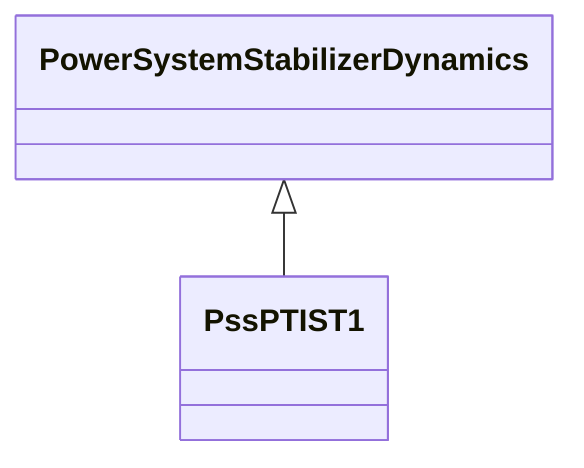

# PssPTIST1

PTI microprocessor-based stabilizer type 1.

## Inheritance

<button class="mermaid-enlarge-button">Enlarge Diagram</button>

## Attributes

| Label | Type | Multiplicity | Comment |
|-------|------|--------------|---------|
| dtc | Float | 1..1 | Time step related to activation of controls (deltatc) (>= 0). Typical value = 0,025. |
| dtf | Float | 1..1 | Time step frequency calculation (deltatf) (>= 0). Typical value = 0,025. |
| dtp | Float | 1..1 | Time step active power calculation (deltatp) (>= 0). Typical value = 0,0125. |
| k | Float | 1..1 | Gain (K). Typical value = 9. |
| m | Float | 1..1 | (M). M = 2 x H. Typical value = 5. |
| t1 | Float | 1..1 | Time constant (T1) (>= 0). Typical value = 0,3. |
| t2 | Float | 1..1 | Time constant (T2) (>= 0). Typical value = 1. |
| t3 | Float | 1..1 | Time constant (T3) (>= 0). Typical value = 0,2. |
| t4 | Float | 1..1 | Time constant (T4) (>= 0). Typical value = 0,05. |
| tf | Float | 1..1 | Time constant (Tf) (>= 0). Typical value = 0,2. |
| tp | Float | 1..1 | Time constant (Tp) (>= 0). Typical value = 0,2. |

