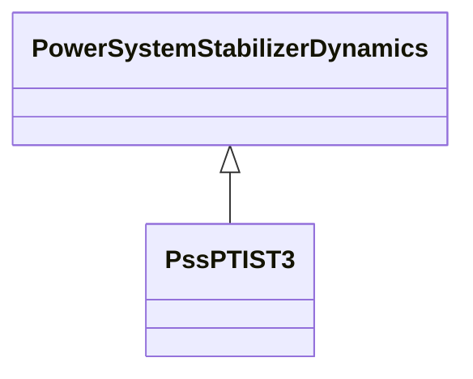

# PssPTIST3

PTI microprocessor-based stabilizer type 3.

## Inheritance

<button class="mermaid-enlarge-button">Enlarge Diagram</button>

## Attributes

| Label | Type | Multiplicity | Comment |
|-------|------|--------------|---------|
| a0 | Float | 1..1 | Filter coefficient (A0). |
| a1 | Float | 1..1 | Limiter (Al). |
| a2 | Float | 1..1 | Filter coefficient (A2). |
| a3 | Float | 1..1 | Filter coefficient (A3). |
| a4 | Float | 1..1 | Filter coefficient (A4). |
| a5 | Float | 1..1 | Filter coefficient (A5). |
| al | Float | 1..1 | Limiter (Al). |
| athres | Float | 1..1 | Threshold value above which output averaging will be bypassed (Athres). Typical value = 0,005. |
| b0 | Float | 1..1 | Filter coefficient (B0). |
| b1 | Float | 1..1 | Filter coefficient (B1). |
| b2 | Float | 1..1 | Filter coefficient (B2). |
| b3 | Float | 1..1 | Filter coefficient (B3). |
| b4 | Float | 1..1 | Filter coefficient (B4). |
| b5 | Float | 1..1 | Filter coefficient (B5). |
| dl | Float | 1..1 | Limiter (Dl). |
| dtc | Float | 1..1 | Time step related to activation of controls (deltatc) (>= 0). Typical value = 0,025 (0,03 for 50 Hz). |
| dtf | Float | 1..1 | Time step frequency calculation (deltatf) (>= 0). Typical value = 0,025 (0,03 for 50 Hz). |
| dtp | Float | 1..1 | Time step active power calculation (deltatp) (>= 0). Typical value = 0,0125 (0,015 for 50 Hz). |
| isw | Boolean | 1..1 | Digital/analogue output switch (Isw). true = produce analogue output false = convert to digital output, using tap selection table. |
| k | Float | 1..1 | Gain (K). Typical value = 9. |
| lthres | Float | 1..1 | Threshold value (Lthres). |
| m | Float | 1..1 | (M). M = 2 x H. Typical value = 5. |
| nav | Float | 1..1 | Number of control outputs to average (NAV) (1 <= NAV <= 16). Typical value = 4. |
| ncl | Float | 1..1 | Number of counts at limit to active limit function (NCL) (> 0). |
| ncr | Float | 1..1 | Number of counts until reset after limit function is triggered (NCR). |
| pmin | Float | 1..1 | (Pmin). |
| t1 | Float | 1..1 | Time constant (T1) (>= 0). Typical value = 0,3. |
| t2 | Float | 1..1 | Time constant (T2) (>= 0). Typical value = 1. |
| t3 | Float | 1..1 | Time constant (T3) (>= 0). Typical value = 0,2. |
| t4 | Float | 1..1 | Time constant (T4) (>= 0). Typical value = 0,05. |
| t5 | Float | 1..1 | Time constant (T5) (>= 0). |
| t6 | Float | 1..1 | Time constant (T6) (>= 0). |
| tf | Float | 1..1 | Time constant (Tf) (>= 0). Typical value = 0,2. |
| tp | Float | 1..1 | Time constant (Tp) (>= 0). Typical value = 0,2. |

