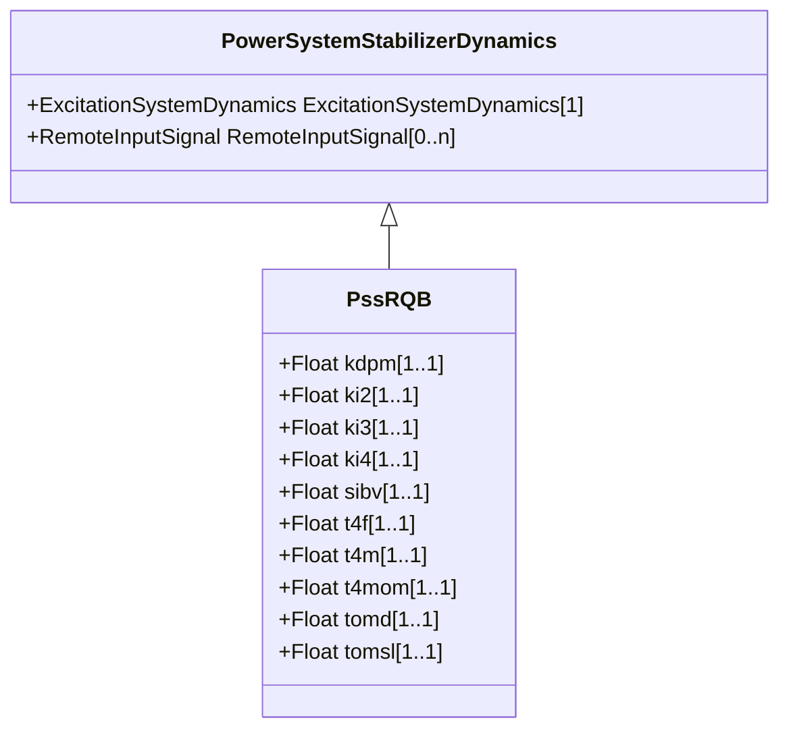

# PssRQB

Power system stabilizer type RQB. This power system stabilizer is intended to be used together with excitation system type ExcRQB, which is primarily used in nuclear or thermal generating units.

## Inheritance

<button class="mermaid-enlarge-button">Enlarge Diagram</button>

## Attributes

| Label | Type | Multiplicity | Comment |
|-------|------|--------------|---------|
| kdpm | Float | 1..1 | Lead lag gain (KDPM). Typical value = 0,185. |
| ki2 | Float | 1..1 | Speed input gain (Ki2). Typical value = 3,43. |
| ki3 | Float | 1..1 | Electrical power input gain (Ki3). Typical value = -11,45. |
| ki4 | Float | 1..1 | Mechanical power input gain (Ki4). Typical value = 11,86. |
| sibv | Float | 1..1 | Speed deadband (SIBV). Typical value = 0,006. |
| t4f | Float | 1..1 | Lead lag time constant (T4F) (>= 0). Typical value = 0,045. |
| t4m | Float | 1..1 | Input time constant (T4M) (>= 0). Typical value = 5. |
| t4mom | Float | 1..1 | Speed time constant (T4MOM) (>= 0). Typical value = 1,27. |
| tomd | Float | 1..1 | Speed delay (TOMD) (>= 0). Typical value = 0,02. |
| tomsl | Float | 1..1 | Speed time constant (TOMSL) (>= 0). Typical value = 0,04. |

