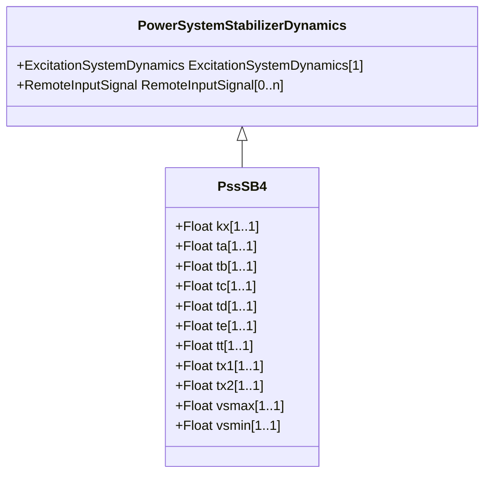

# PssSB4

Power sensitive stabilizer model.

## Inheritance

<button class="mermaid-enlarge-button">Enlarge Diagram</button>

## Attributes

| Label | Type | Multiplicity | Comment |
|-------|------|--------------|---------|
| kx | Float | 1..1 | Gain (Kx). Typical value = 2,7. |
| ta | Float | 1..1 | Time constant (Ta) (>= 0). Typical value = 0,37. |
| tb | Float | 1..1 | Time constant (Tb) (>= 0). Typical value = 0,37. |
| tc | Float | 1..1 | Time constant (Tc) (>= 0). Typical value = 0,035. |
| td | Float | 1..1 | Time constant (Td) (>= 0). Typical value = 0,0. |
| te | Float | 1..1 | Time constant (Te) (>= 0). Typical value = 0,0169. |
| tt | Float | 1..1 | Time constant (Tt) (>= 0). Typical value = 0,18. |
| tx1 | Float | 1..1 | Reset time constant (Tx1) (>= 0). Typical value = 0,035. |
| tx2 | Float | 1..1 | Time constant (Tx2) (>= 0). Typical value = 5,0. |
| vsmax | Float | 1..1 | Limiter (Vsmax) (> PssSB4.vsmin). Typical value = 0,062. |
| vsmin | Float | 1..1 | Limiter (Vsmin) (< PssSB4.vsmax). Typical value = -0,062. |

