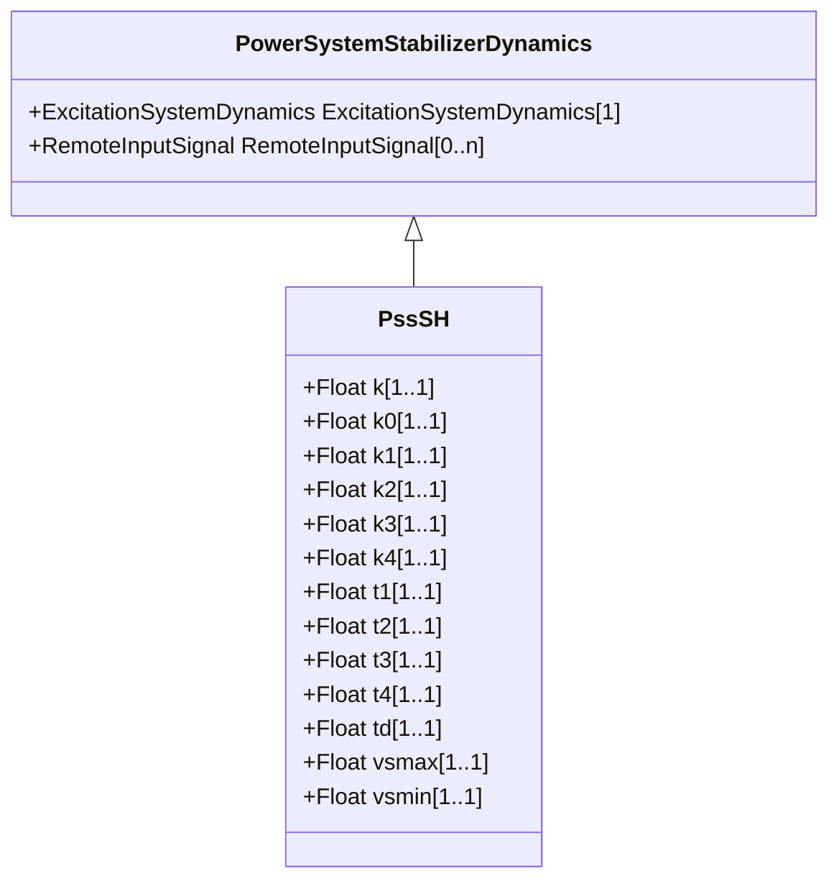

# PssSH

SiemensTM “H infinity” power system stabilizer with generator electrical power input. [Footnote: Siemens 'H infinity' power system stabilizers are an example of suitable products available commercially. This information is given for the convenience of users of this document and does not constitute an endorsement by IEC of these products.]

## Inheritance

<button class="mermaid-enlarge-button">Enlarge Diagram</button>

## Attributes

| Label | Type | Multiplicity | Comment |
|-------|------|--------------|---------|
| k | Float | 1..1 | Main gain (K). Typical value = 1. |
| k0 | Float | 1..1 | Gain 0 (K0). Typical value = 0,012. |
| k1 | Float | 1..1 | Gain 1 (K1). Typical value = 0,488. |
| k2 | Float | 1..1 | Gain 2 (K2). Typical value = 0,064. |
| k3 | Float | 1..1 | Gain 3 (K3). Typical value = 0,224. |
| k4 | Float | 1..1 | Gain 4 (K4). Typical value = 0,1. |
| t1 | Float | 1..1 | Time constant 1 (T1) (> 0). Typical value = 0,076. |
| t2 | Float | 1..1 | Time constant 2 (T2) (> 0). Typical value = 0,086. |
| t3 | Float | 1..1 | Time constant 3 (T3) (> 0). Typical value = 1,068. |
| t4 | Float | 1..1 | Time constant 4 (T4) (> 0). Typical value = 1,913. |
| td | Float | 1..1 | Input time constant (Td) (>= 0). Typical value = 10. |
| vsmax | Float | 1..1 | Output maximum limit (Vsmax) (> PssSH.vsmin). Typical value = 0,1. |
| vsmin | Float | 1..1 | Output minimum limit (Vsmin) (< PssSH.vsmax). Typical value = -0,1. |

