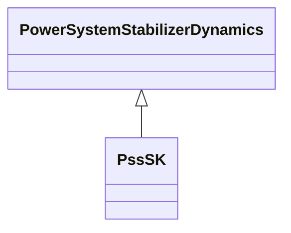

# PssSK

Slovakian PSS with three inputs.

## Inheritance

<button class="mermaid-enlarge-button">Enlarge Diagram</button>

## Attributes

| Label | Type | Multiplicity | Comment |
|-------|------|--------------|---------|
| k1 | Float | 1..1 | Gain P (K1). Typical value = -0,3. |
| k2 | Float | 1..1 | Gain fE (K2). Typical value = -0,15. |
| k3 | Float | 1..1 | Gain If (K3). Typical value = 10. |
| t1 | Float | 1..1 | Denominator time constant (T1) (> 0,005). Typical value = 0,3. |
| t2 | Float | 1..1 | Filter time constant (T2) (> 0,005). Typical value = 0,35. |
| t3 | Float | 1..1 | Denominator time constant (T3) (> 0,005). Typical value = 0,22. |
| t4 | Float | 1..1 | Filter time constant (T4) (> 0,005). Typical value = 0,02. |
| t5 | Float | 1..1 | Denominator time constant (T5) (> 0,005). Typical value = 0,02. |
| t6 | Float | 1..1 | Filter time constant (T6) (> 0,005). Typical value = 0,02. |
| vsmax | Float | 1..1 | Stabilizer output maximum limit (VSMAX) (> PssSK.vsmin). Typical value = 0,4. |
| vsmin | Float | 1..1 | Stabilizer output minimum limit (VSMIN) (< PssSK.vsmax). Typical value = -0.4. |

