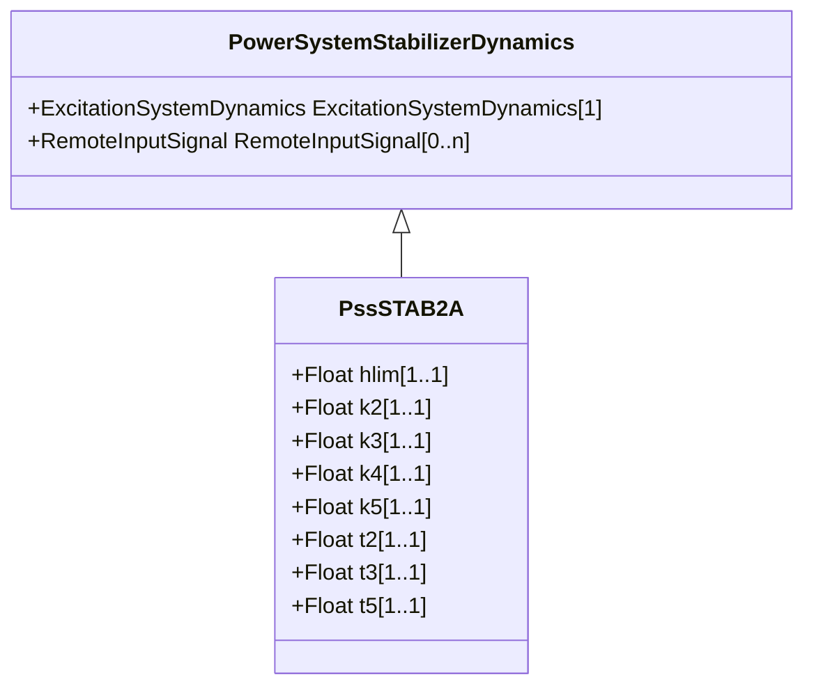

# PssSTAB2A

Power system stabilizer part of an ABB excitation system. [Footnote: ABB excitation systems are an example of suitable products available commercially. This information is given for the convenience of users of this document and does not constitute an endorsement by IEC of these products.]

## Inheritance

<button class="mermaid-enlarge-button">Enlarge Diagram</button>

## Attributes

| Label | Type | Multiplicity | Comment |
|-------|------|--------------|---------|
| hlim | Float | 1..1 | Stabilizer output limiter (HLIM). Typical value = 0,5. |
| k2 | Float | 1..1 | Gain (K2). Typical value = 1,0. |
| k3 | Float | 1..1 | Gain (K3). Typical value = 0,25. |
| k4 | Float | 1..1 | Gain (K4). Typical value = 0,075. |
| k5 | Float | 1..1 | Gain (K5). Typical value = 2,5. |
| t2 | Float | 1..1 | Time constant (T2). Typical value = 4,0. |
| t3 | Float | 1..1 | Time constant (T3). Typical value = 2,0. |
| t5 | Float | 1..1 | Time constant (T5). Typical value = 4,5. |

