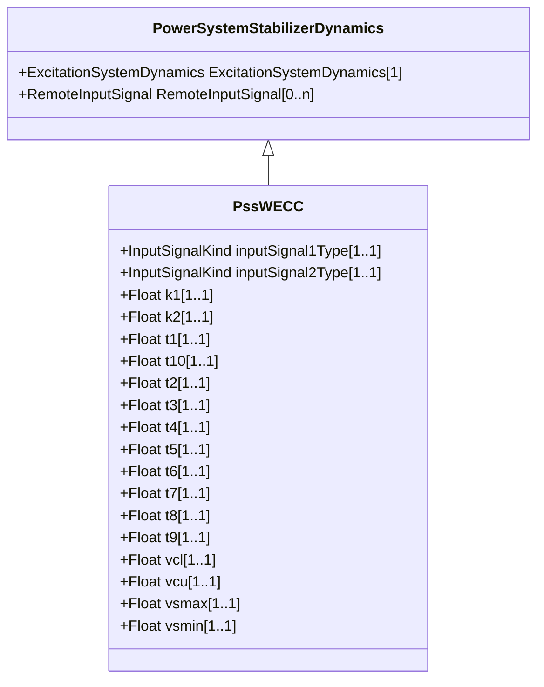

# PssWECC

Dual input power system stabilizer, based on IEEE type 2, with modified output limiter defined by WECC (Western Electricity Coordinating Council, USA).

## Inheritance

<button class="mermaid-enlarge-button">Enlarge Diagram</button>

## Attributes

| Label | Type | Multiplicity | Comment |
|-------|------|--------------|---------|
| inputSignal1Type | [InputSignalKind](InputSignalKind.md) | 1..1 | Type of input signal #1 (rotorAngularFrequencyDeviation, busFrequencyDeviation, generatorElectricalPower, generatorAcceleratingPower, busVoltage, or busVoltageDerivative - shall be different than PssWECC.inputSignal2Type). Typical value = rotorAngularFrequencyDeviation. |
| inputSignal2Type | [InputSignalKind](InputSignalKind.md) | 1..1 | Type of input signal #2 (rotorAngularFrequencyDeviation, busFrequencyDeviation, generatorElectricalPower, generatorAcceleratingPower, busVoltage, busVoltageDerivative - shall be different than PssWECC.inputSignal1Type). Typical value = busVoltageDerivative. |
| k1 | Float | 1..1 | Input signal 1 gain (K1). Typical value = 1,13. |
| k2 | Float | 1..1 | Input signal 2 gain (K2). Typical value = 0,0. |
| t1 | Float | 1..1 | Input signal 1 transducer time constant (T1) (>= 0). Typical value = 0,037. |
| t10 | Float | 1..1 | Lag time constant (T10) (>= 0). Typical value = 0. |
| t2 | Float | 1..1 | Input signal 2 transducer time constant (T2) (>= 0). Typical value = 0,0. |
| t3 | Float | 1..1 | Stabilizer washout time constant (T3) (>= 0). Typical value = 9,5. |
| t4 | Float | 1..1 | Stabilizer washout time lag constant (T4) (>= 0). Typical value = 9,5. |
| t5 | Float | 1..1 | Lead time constant (T5) (>= 0). Typical value = 1,7. |
| t6 | Float | 1..1 | Lag time constant (T6) (>= 0). Typical value = 1,5. |
| t7 | Float | 1..1 | Lead time constant (T7) (>= 0). Typical value = 1,7. |
| t8 | Float | 1..1 | Lag time constant (T8) (>= 0). Typical value = 1,5. |
| t9 | Float | 1..1 | Lead time constant (T9) (>= 0). Typical value = 0. |
| vcl | Float | 1..1 | Minimum value for voltage compensator output (VCL). Typical value = 0. |
| vcu | Float | 1..1 | Maximum value for voltage compensator output (VCU). Typical value = 0. |
| vsmax | Float | 1..1 | Maximum output signal (Vsmax) (> PssWECC.vsmin). Typical value = 0,05. |
| vsmin | Float | 1..1 | Minimum output signal (Vsmin) (< PssWECC.vsmax). Typical value = -0,05. |

