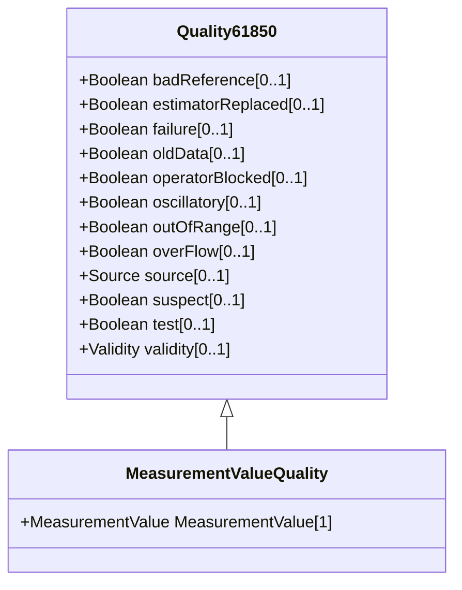

# Quality61850

Quality flags in this class are as defined in IEC 61850, except for estimatorReplaced, which has been included in this class for convenience.

## Inheritance

<button class="mermaid-enlarge-button">Enlarge Diagram</button>

## Attributes

| Label | Type | Multiplicity | Comment |
|-------|------|--------------|---------|
| badReference | Boolean | 0..1 | Measurement value may be incorrect due to a reference being out of calibration. |
| estimatorReplaced | Boolean | 0..1 | Value has been replaced by State Estimator. estimatorReplaced is not an IEC61850 quality bit but has been put in this class for convenience. |
| failure | Boolean | 0..1 | This identifier indicates that a supervision function has detected an internal or external failure, e.g. communication failure. |
| oldData | Boolean | 0..1 | Measurement value is old and possibly invalid, as it has not been successfully updated during a specified time interval. |
| operatorBlocked | Boolean | 0..1 | Measurement value is blocked and hence unavailable for transmission. |
| oscillatory | Boolean | 0..1 | To prevent some overload of the communication it is sensible to detect and suppress oscillating (fast changing) binary inputs. If a signal changes in a defined time twice in the same direction (from 0 to 1 or from 1 to 0) then oscillation is detected and the detail quality identifier 'oscillatory' is set. If it is detected a configured numbers of transient changes could be passed by. In this time the validity status 'questionable' is set. If after this defined numbers of changes the signal is still in the oscillating state the value shall be set either to the opposite state of the previous stable value or to a defined default value. In this case the validity status 'questionable' is reset and 'invalid' is set as long as the signal is oscillating. If it is configured such that no transient changes should be passed by then the validity status 'invalid' is set immediately in addition to the detail quality identifier 'oscillatory' (used for status information only). |
| outOfRange | Boolean | 0..1 | Measurement value is beyond a predefined range of value. |
| overFlow | Boolean | 0..1 | Measurement value is beyond the capability of being represented properly. For example, a counter value overflows from maximum count back to a value of zero. |
| source | [Source](Source.md) | 0..1 | Source gives information related to the origin of a value. The value may be acquired from the process, defaulted or substituted. |
| suspect | Boolean | 0..1 | A correlation function has detected that the value is not consistent with other values. Typically set by a network State Estimator. |
| test | Boolean | 0..1 | Measurement value is transmitted for test purposes. |
| validity | [Validity](Validity.md) | 0..1 | Validity of the measurement value. |

