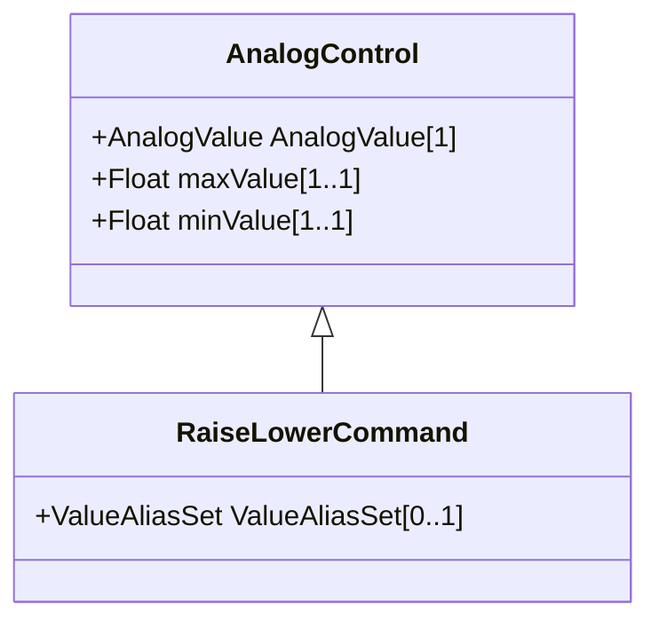

# RaiseLowerCommand

An analog control that increases or decreases a set point value with pulses. Unless otherwise specified, one pulse moves the set point by one.

## Inheritance

<button class="mermaid-enlarge-button">Enlarge Diagram</button>

## Attributes

| Label | Type | Multiplicity | Comment |
|-------|------|--------------|---------|
| ValueAliasSet | [ValueAliasSet](ValueAliasSet.md) | 0..1 | The ValueAliasSet used for translation of a Control value to a name. |

