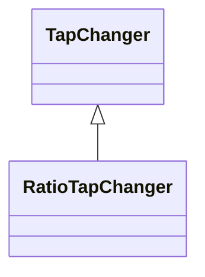

# RatioTapChanger

A tap changer that changes the voltage ratio impacting the voltage magnitude but not the phase angle across the transformer. Angle sign convention (general): Positive value indicates a positive phase shift from the winding where the tap is located to the other winding (for a two-winding transformer).

## Inheritance

<button class="mermaid-enlarge-button">Enlarge Diagram</button>

## Attributes

| Label | Type | Multiplicity | Comment |
|-------|------|--------------|---------|
| RatioTapChangerTable | [RatioTapChangerTable](RatioTapChangerTable.md) | 0..1 | The tap ratio table for this ratio tap changer. |
| TransformerEnd | [TransformerEnd](TransformerEnd.md) | 1 | Transformer end to which this ratio tap changer belongs. |
| stepVoltageIncrement | Float | 1..1 | Tap step increment, in per cent of rated voltage of the power transformer end, per step position. When the increment is negative, the voltage decreases when the tap step increases. |

