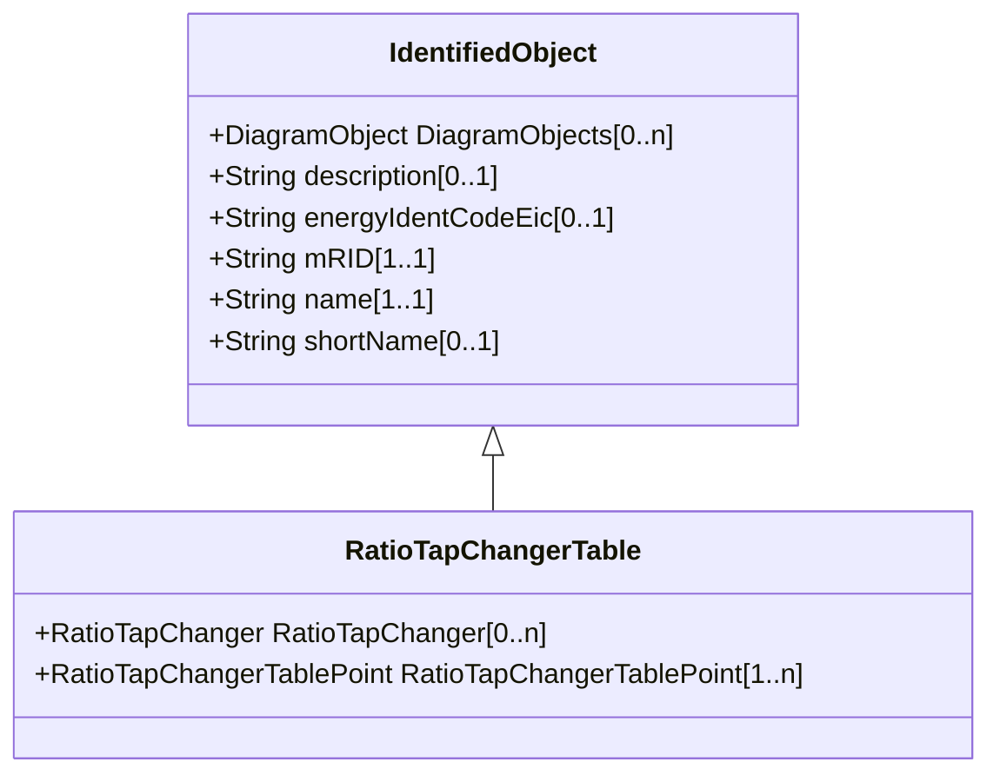

# RatioTapChangerTable

Describes a curve for how the voltage magnitude and impedance varies with the tap step.

## Inheritance

<button class="mermaid-enlarge-button">Enlarge Diagram</button>

## Attributes

| Label | Type | Multiplicity | Comment |
|-------|------|--------------|---------|
| RatioTapChanger | [RatioTapChanger](RatioTapChanger.md) | 0..n | The ratio tap changer of this tap ratio table. |
| RatioTapChangerTablePoint | [RatioTapChangerTablePoint](RatioTapChangerTablePoint.md) | 1..n | Points of this table. |

