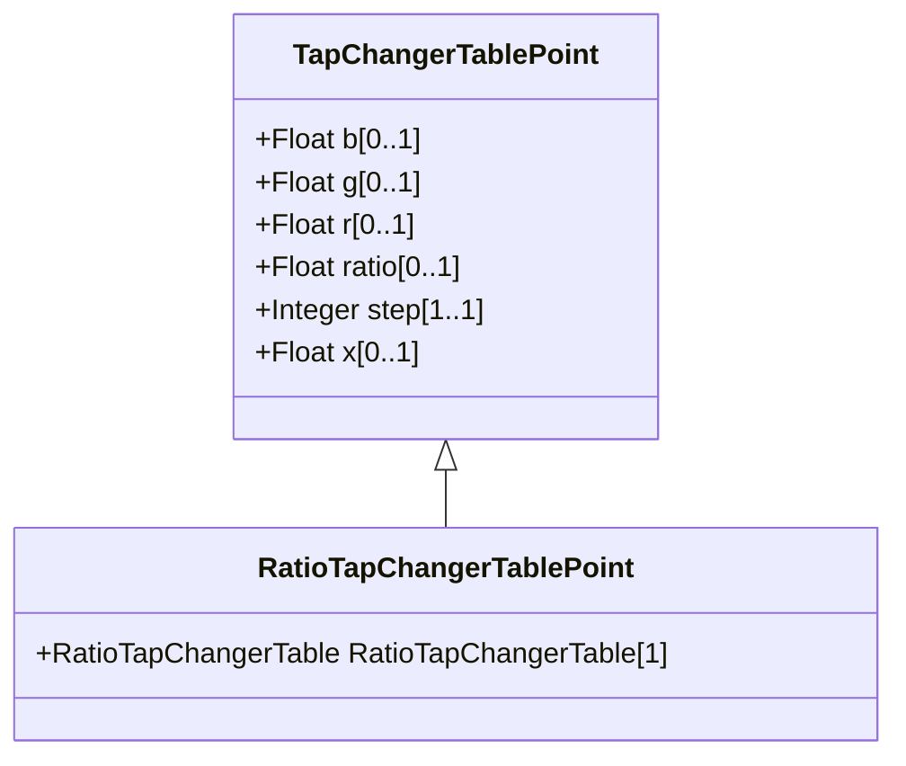

# RatioTapChangerTablePoint

Describes each tap step in the ratio tap changer tabular curve.

## Inheritance

<button class="mermaid-enlarge-button">Enlarge Diagram</button>

## Attributes

| Label | Type | Multiplicity | Comment |
|-------|------|--------------|---------|
| RatioTapChangerTable | [RatioTapChangerTable](RatioTapChangerTable.md) | 1 | Table of this point. |

