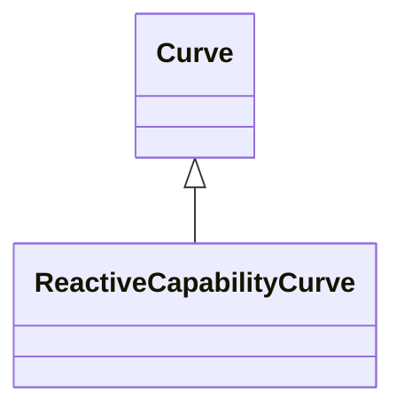

# ReactiveCapabilityCurve

Reactive power rating envelope versus the synchronous machine's active power, in both the generating and motoring modes. For each active power value there is a corresponding high and low reactive power limit value. Typically there will be a separate curve for each coolant condition, such as hydrogen pressure. The Y1 axis values represent reactive minimum and the Y2 axis values represent reactive maximum.

## Inheritance

<button class="mermaid-enlarge-button">Enlarge Diagram</button>

## Attributes

| Label | Type | Multiplicity | Comment |
|-------|------|--------------|---------|
| EquivalentInjection | [EquivalentInjection](EquivalentInjection.md) | 0..n | The equivalent injection using this reactive capability curve. |
| InitiallyUsedBySynchronousMachines | [SynchronousMachine](SynchronousMachine.md) | 1..n | Synchronous machines using this curve as default. |

