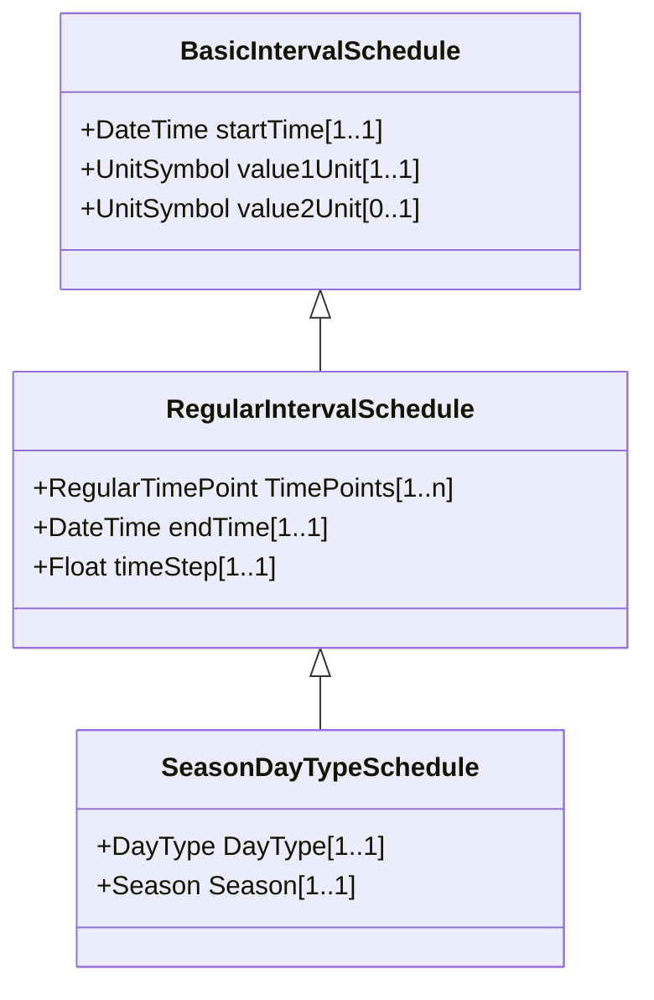

# RegularIntervalSchedule

The schedule has time points where the time between them is constant.

## Inheritance

<button class="mermaid-enlarge-button">Enlarge Diagram</button>

## Attributes

| Label | Type | Multiplicity | Comment |
|-------|------|--------------|---------|
| TimePoints | [RegularTimePoint](RegularTimePoint.md) | 1..n | The regular interval time point data values that define this schedule. |
| endTime | DateTime | 1..1 | The time for the last time point. The value can be a time of day, not a specific date. |
| timeStep | Float | 1..1 | The time between each pair of subsequent regular time points in sequence order. |

