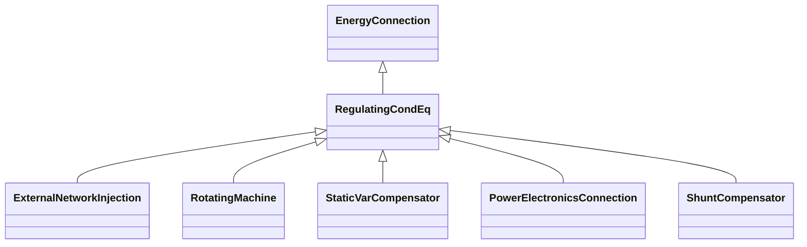

# RegulatingCondEq

A type of conducting equipment that can regulate a quantity (i.e. voltage or flow) at a specific point in the network.

## Inheritance

<button class="mermaid-enlarge-button">Enlarge Diagram</button>

## Attributes

| Label | Type | Multiplicity | Comment |
|-------|------|--------------|---------|
| RegulatingControl | [RegulatingControl](RegulatingControl.md) | 0..1 | The regulating control scheme in which this equipment participates. |
| controlEnabled | Boolean | 1..1 | Specifies the regulation status of the equipment. True is regulating, false is not regulating. |

