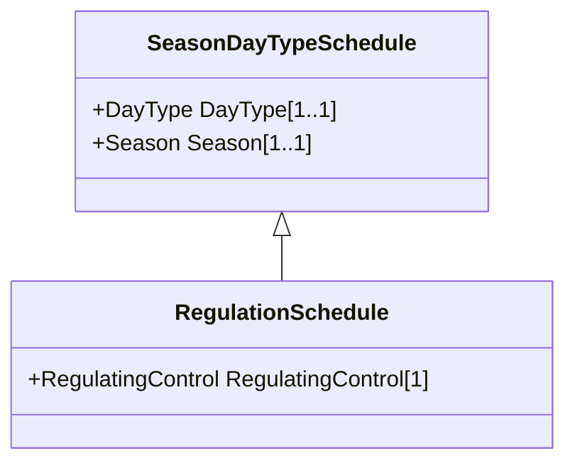

# RegulationSchedule

A pre-established pattern over time for a controlled variable, e.g., busbar voltage.

## Inheritance

<button class="mermaid-enlarge-button">Enlarge Diagram</button>

## Attributes

| Label | Type | Multiplicity | Comment |
|-------|------|--------------|---------|
| RegulatingControl | [RegulatingControl](RegulatingControl.md) | 1 | Regulating controls that have this schedule. |

