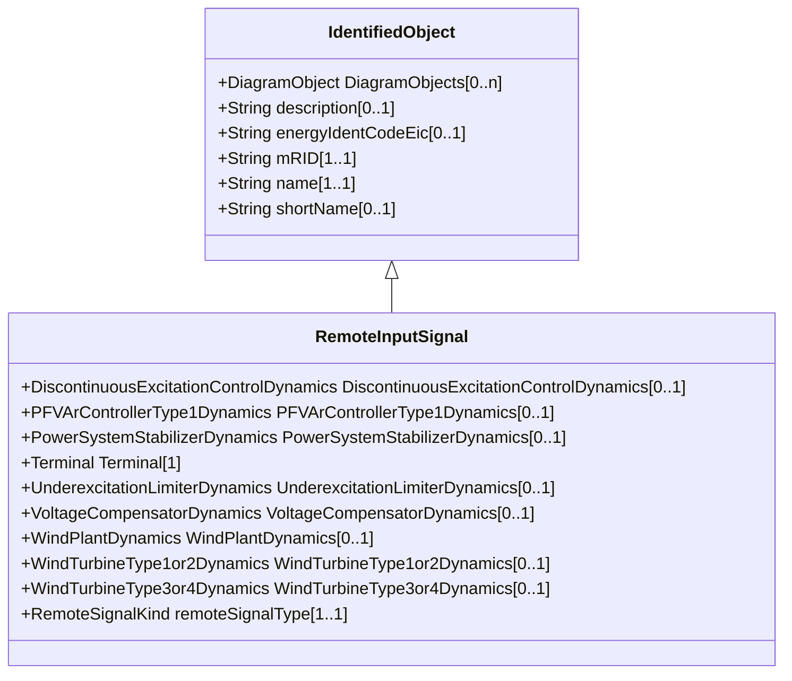

# RemoteInputSignal

Supports connection to a terminal associated with a remote bus from which an input signal of a specific type is coming.

## Inheritance

<button class="mermaid-enlarge-button">Enlarge Diagram</button>

## Attributes

| Label | Type | Multiplicity | Comment |
|-------|------|--------------|---------|
| DiscontinuousExcitationControlDynamics | [DiscontinuousExcitationControlDynamics](DiscontinuousExcitationControlDynamics.md) | 0..1 | Discontinuous excitation control model using this remote input signal. |
| PFVArControllerType1Dynamics | [PFVArControllerType1Dynamics](PFVArControllerType1Dynamics.md) | 0..1 | Power factor or VAr controller type 1 model using this remote input signal. |
| PowerSystemStabilizerDynamics | [PowerSystemStabilizerDynamics](PowerSystemStabilizerDynamics.md) | 0..1 | Power system stabilizer model using this remote input signal. |
| Terminal | [Terminal](Terminal.md) | 1 | Remote terminal with which this input signal is associated. |
| UnderexcitationLimiterDynamics | [UnderexcitationLimiterDynamics](UnderexcitationLimiterDynamics.md) | 0..1 | Underexcitation limiter model using this remote input signal. |
| VoltageCompensatorDynamics | [VoltageCompensatorDynamics](VoltageCompensatorDynamics.md) | 0..1 | Voltage compensator model using this remote input signal. |
| WindPlantDynamics | [WindPlantDynamics](WindPlantDynamics.md) | 0..1 | The wind plant using the remote signal. |
| WindTurbineType1or2Dynamics | [WindTurbineType1or2Dynamics](WindTurbineType1or2Dynamics.md) | 0..1 | Wind generator type 1 or type 2 model using this remote input signal. |
| WindTurbineType3or4Dynamics | [WindTurbineType3or4Dynamics](WindTurbineType3or4Dynamics.md) | 0..1 | Wind turbine type 3 or type 4 models using this remote input signal. |
| remoteSignalType | [RemoteSignalKind](RemoteSignalKind.md) | 1..1 | Type of input signal. |

