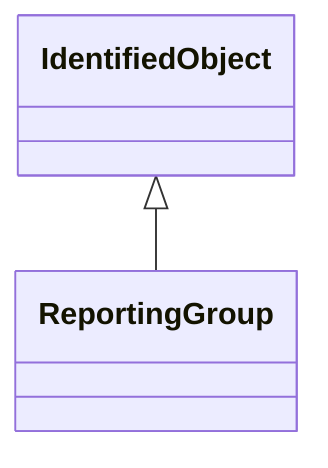

# ReportingGroup

A reporting group is used for various ad-hoc groupings used for reporting.

## Inheritance

<button class="mermaid-enlarge-button">Enlarge Diagram</button>

## Attributes

| Label | Type | Multiplicity | Comment |
|-------|------|--------------|---------|
| BusNameMarker | [BusNameMarker](BusNameMarker.md) | 0..n | The bus name markers that belong to this reporting group. |
| TopologicalNode | [TopologicalNode](TopologicalNode.md) | 0..n | The topological nodes that belong to the reporting group. |

