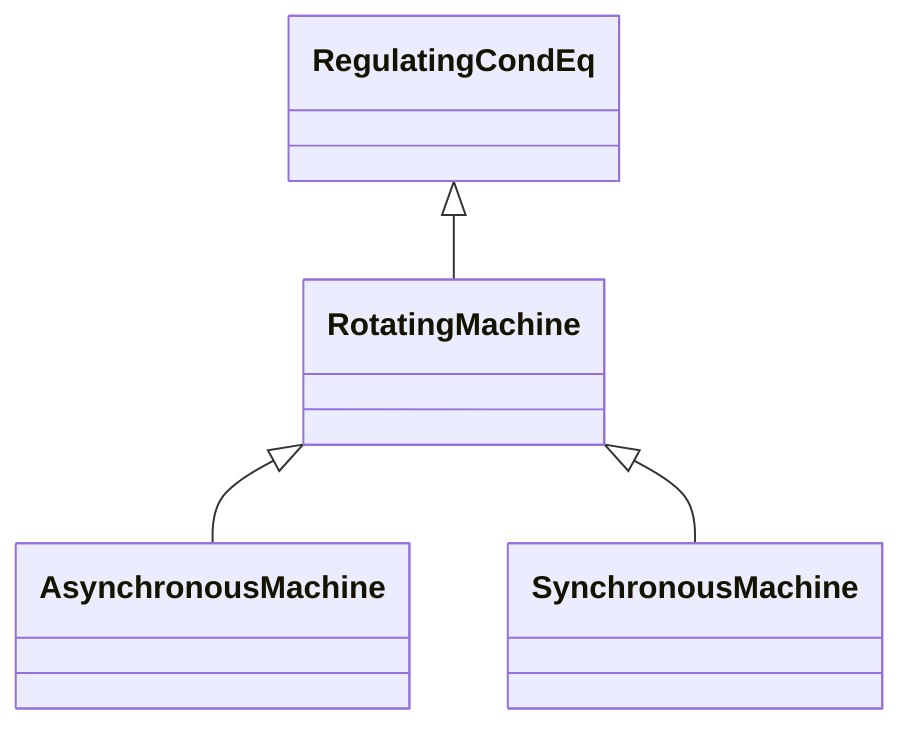

# RotatingMachine

A rotating machine which may be used as a generator or motor.

## Inheritance

<button class="mermaid-enlarge-button">Enlarge Diagram</button>

## Attributes

| Label | Type | Multiplicity | Comment |
|-------|------|--------------|---------|
| GeneratingUnit | [GeneratingUnit](GeneratingUnit.md) | 0..1 | A synchronous machine may operate as a generator and as such becomes a member of a generating unit. |
| HydroPump | [HydroPump](HydroPump.md) | 0..1 | The synchronous machine drives the turbine which moves the water from a low elevation to a higher elevation. The direction of machine rotation for pumping may or may not be the same as for generating. |
| p | Float | 1..1 | Active power injection. Load sign convention is used, i.e. positive sign means flow out from a node. Starting value for a steady state solution. |
| q | Float | 1..1 | Reactive power injection. Load sign convention is used, i.e. positive sign means flow out from a node. Starting value for a steady state solution. |
| ratedPowerFactor | Float | 0..1 | Power factor (nameplate data). It is primarily used for short circuit data exchange according to IEC 60909. The attribute cannot be a negative value. |
| ratedS | Float | 0..1 | Nameplate apparent power rating for the unit. The attribute shall have a positive value. |
| ratedU | Float | 0..1 | Rated voltage (nameplate data, Ur in IEC 60909-0). It is primarily used for short circuit data exchange according to IEC 60909. The attribute shall be a positive value. |

