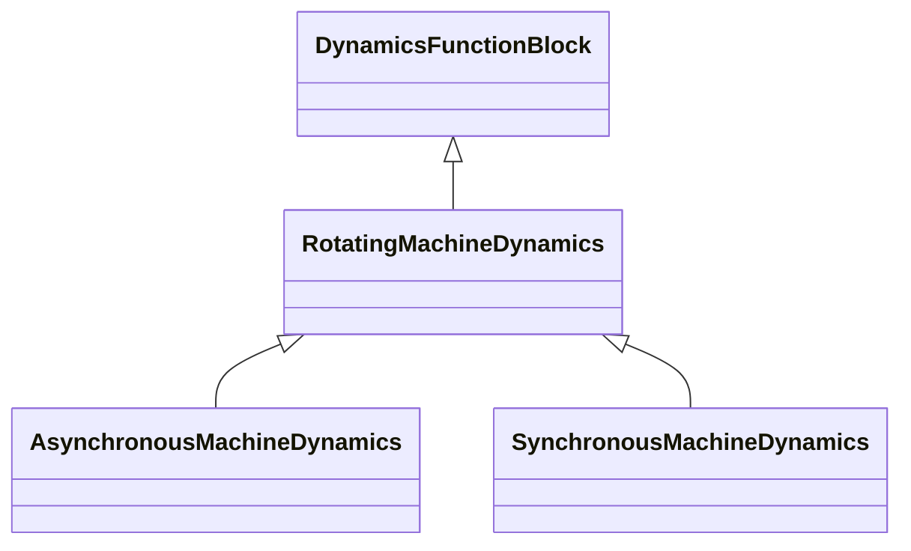

# RotatingMachineDynamics

Abstract parent class for all synchronous and asynchronous machine standard models.

## Inheritance

<button class="mermaid-enlarge-button">Enlarge Diagram</button>

## Attributes

| Label | Type | Multiplicity | Comment |
|-------|------|--------------|---------|
| damping | Float | 1..1 | Damping torque coefficient (D) (>= 0). A proportionality constant that, when multiplied by the angular velocity of the rotor poles with respect to the magnetic field (frequency), results in the damping torque. This value is often zero when the sources of damping torques (generator damper windings, load damping effects, etc.) are modelled in detail. Typical value = 0. |
| inertia | Float | 1..1 | Inertia constant of generator or motor and mechanical load (H) (> 0). This is the specification for the stored energy in the rotating mass when operating at rated speed. For a generator, this includes the generator plus all other elements (turbine, exciter) on the same shaft and has units of MW x s. For a motor, it includes the motor plus its mechanical load. Conventional units are PU on the generator MVA base, usually expressed as MW x s / MVA or just s. This value is used in the accelerating power reference frame for operator training simulator solutions. Typical value = 3. |
| saturationFactor | Float | 0..1 | Saturation factor at rated terminal voltage (S1) (>= 0). Not used by simplified model. Defined by defined by S(E1) in the SynchronousMachineSaturationParameters diagram. Typical value = 0,02. |
| saturationFactor120 | Float | 0..1 | Saturation factor at 120% of rated terminal voltage (S12) (>= RotatingMachineDynamics.saturationFactor). Not used by the simplified model, defined by S(E2) in the SynchronousMachineSaturationParameters diagram. Typical value = 0,12. |
| statorLeakageReactance | Float | 1..1 | Stator leakage reactance (Xl) (>= 0). Typical value = 0,15. |
| statorResistance | Float | 1..1 | Stator (armature) resistance (Rs) (>= 0). Typical value = 0,005. |

