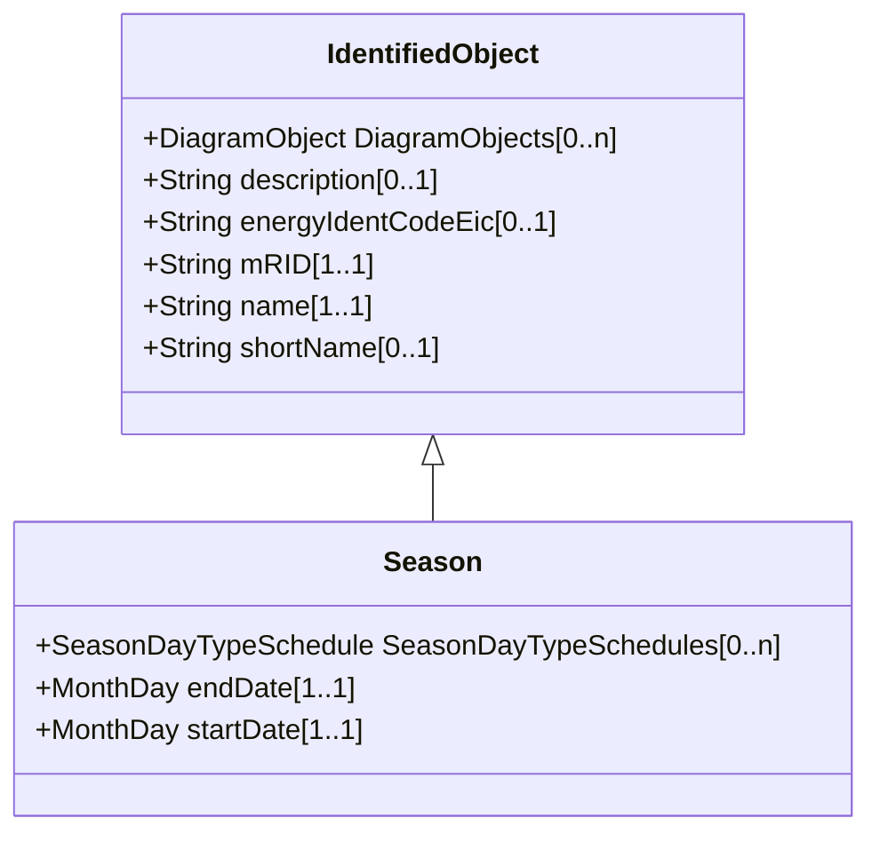

# Season

A specified time period of the year.

## Inheritance

<button class="mermaid-enlarge-button">Enlarge Diagram</button>

## Attributes

| Label | Type | Multiplicity | Comment |
|-------|------|--------------|---------|
| SeasonDayTypeSchedules | [SeasonDayTypeSchedule](SeasonDayTypeSchedule.md) | 0..n | Schedules that use this Season. |
| endDate | MonthDay | 1..1 | Date season ends. |
| startDate | MonthDay | 1..1 | Date season starts. |

