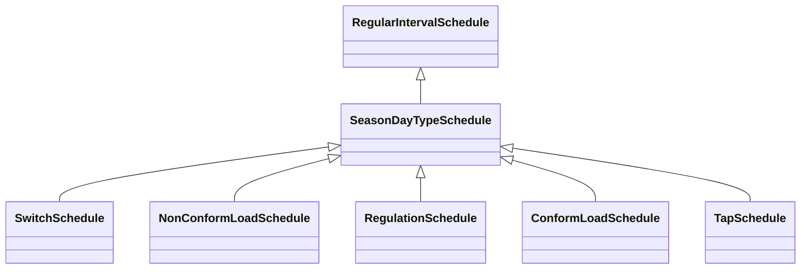

# SeasonDayTypeSchedule

A time schedule covering a 24 hour period, with curve data for a specific type of season and day.

## Inheritance

<button class="mermaid-enlarge-button">Enlarge Diagram</button>

## Attributes

| Label | Type | Multiplicity | Comment |
|-------|------|--------------|---------|
| DayType | [DayType](DayType.md) | 1..1 | DayType for the Schedule. |
| Season | [Season](Season.md) | 1..1 | Season for the Schedule. |

