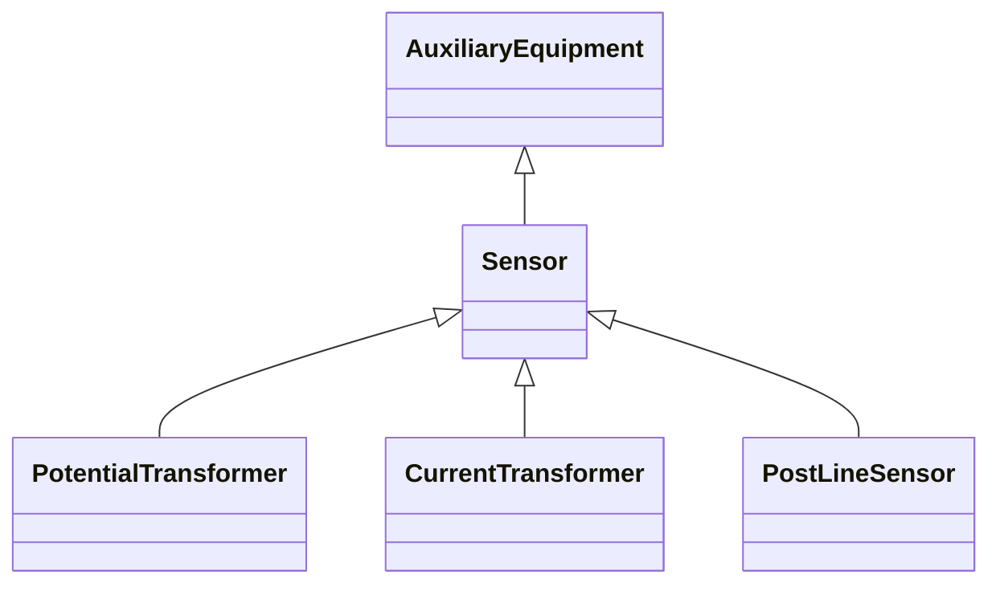

# Sensor

This class describe devices that transform a measured quantity into signals that can be presented at displays, used in control or be recorded.

## Inheritance

<button class="mermaid-enlarge-button">Enlarge Diagram</button>

## Attributes

| Label | Type | Multiplicity | Comment |
|-------|------|--------------|---------|
| No attributes | | | |

