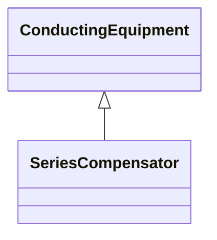

# SeriesCompensator

A Series Compensator is a series capacitor or reactor or an AC transmission line without charging susceptance. It is a two terminal device.

## Inheritance

<button class="mermaid-enlarge-button">Enlarge Diagram</button>

## Attributes

| Label | Type | Multiplicity | Comment |
|-------|------|--------------|---------|
| r | Float | 1..1 | Positive sequence resistance. |
| r0 | Float | 1..1 | Zero sequence resistance. |
| varistorPresent | Boolean | 1..1 | Describe if a metal oxide varistor (mov) for over voltage protection is configured in parallel with the series compensator. It is used for short circuit calculations. |
| varistorRatedCurrent | Float | 0..1 | The maximum current the varistor is designed to handle at specified duration. It is used for short circuit calculations and exchanged only if SeriesCompensator.varistorPresent is true. The attribute shall be a positive value. |
| varistorVoltageThreshold | Float | 0..1 | The dc voltage at which the varistor starts conducting. It is used for short circuit calculations and exchanged only if SeriesCompensator.varistorPresent is true. |
| x | Float | 1..1 | Positive sequence reactance. |
| x0 | Float | 1..1 | Zero sequence reactance. |

