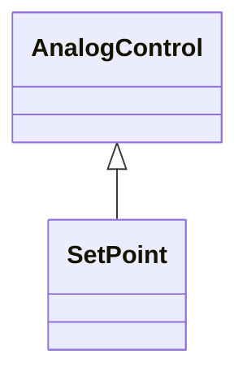

# SetPoint

An analog control that issues a set point value.

## Inheritance

<button class="mermaid-enlarge-button">Enlarge Diagram</button>

## Attributes

| Label | Type | Multiplicity | Comment |
|-------|------|--------------|---------|
| normalValue | Float | 1..1 | Normal value for Control.value e.g. used for percentage scaling. |
| value | Float | 1..1 | The value representing the actuator output. |

