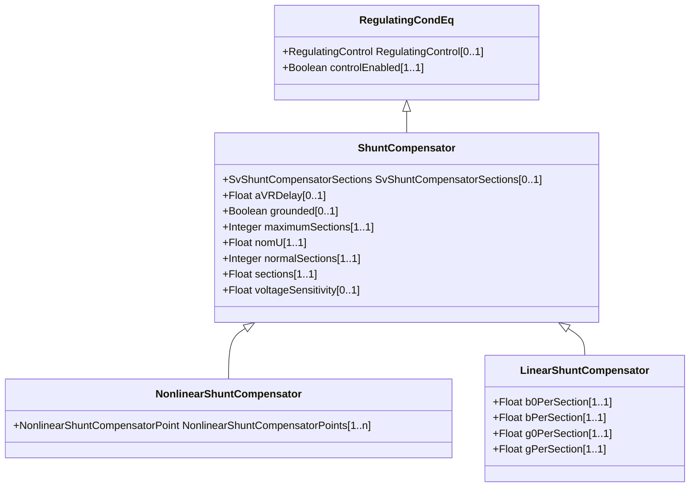

# ShuntCompensator

A shunt capacitor or reactor or switchable bank of shunt capacitors or reactors. A section of a shunt compensator is an individual capacitor or reactor. A negative value for bPerSection indicates that the compensator is a reactor. ShuntCompensator is a single terminal device. Ground is implied.

## Inheritance

<button class="mermaid-enlarge-button">Enlarge Diagram</button>

## Attributes

| Label | Type | Multiplicity | Comment |
|-------|------|--------------|---------|
| SvShuntCompensatorSections | [SvShuntCompensatorSections](SvShuntCompensatorSections.md) | 0..1 | The state for the number of shunt compensator sections in service. |
| aVRDelay | Float | 0..1 | An automatic voltage regulation delay (AVRDelay) which is the time delay from a change in voltage to when the capacitor is allowed to change state. This filters out temporary changes in voltage. |
| grounded | Boolean | 0..1 | Used for Yn and Zn connections. True if the neutral is solidly grounded. |
| maximumSections | Integer | 1..1 | The maximum number of sections that may be switched in. |
| nomU | Float | 1..1 | The voltage at which the nominal reactive power may be calculated. This should normally be within 10% of the voltage at which the capacitor is connected to the network. |
| normalSections | Integer | 1..1 | The normal number of sections switched in. The value shall be between zero and ShuntCompensator.maximumSections. |
| sections | Float | 1..1 | Shunt compensator sections in use. Starting value for steady state solution. The attribute shall be a positive value or zero. Non integer values are allowed to support continuous variables. The reasons for continuous value are to support study cases where no discrete shunt compensators has yet been designed, a solutions where a narrow voltage band force the sections to oscillate or accommodate for a continuous solution as input. For LinearShuntConpensator the value shall be between zero and ShuntCompensator.maximumSections. At value zero the shunt compensator conductance and admittance is zero. Linear interpolation of conductance and admittance between the previous and next integer section is applied in case of non-integer values. For NonlinearShuntCompensator-s shall only be set to one of the NonlinearShuntCompenstorPoint.sectionNumber. There is no interpolation between NonlinearShuntCompenstorPoint-s. |
| voltageSensitivity | Float | 0..1 | Voltage sensitivity required for the device to regulate the bus voltage, in voltage/reactive power. |

