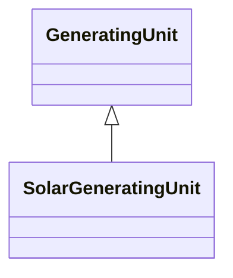

# SolarGeneratingUnit

A solar thermal generating unit, connected to the grid by means of a rotating machine. This class does not represent photovoltaic (PV) generation.

## Inheritance

<button class="mermaid-enlarge-button">Enlarge Diagram</button>

## Attributes

| Label | Type | Multiplicity | Comment |
|-------|------|--------------|---------|
| SolarPowerPlant | [SolarPowerPlant](SolarPowerPlant.md) | 0..1 | A solar power plant may have solar generating units. |

