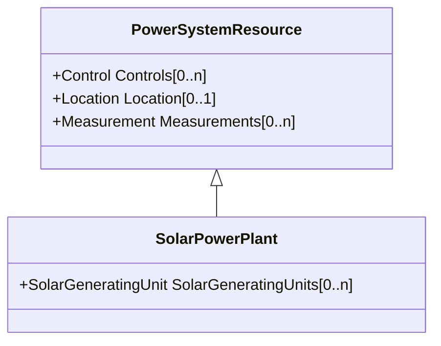

# SolarPowerPlant

Solar power plant.

## Inheritance

<button class="mermaid-enlarge-button">Enlarge Diagram</button>

## Attributes

| Label | Type | Multiplicity | Comment |
|-------|------|--------------|---------|
| SolarGeneratingUnits | [SolarGeneratingUnit](SolarGeneratingUnit.md) | 0..n | A solar generating unit or units may be a member of a solar power plant. |

