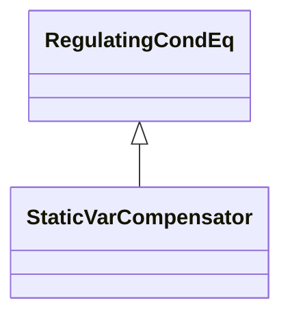

# StaticVarCompensator

A facility for providing variable and controllable shunt reactive power. The SVC typically consists of a stepdown transformer, filter, thyristor-controlled reactor, and thyristor-switched capacitor arms. The SVC may operate in fixed MVar output mode or in voltage control mode. When in voltage control mode, the output of the SVC will be proportional to the deviation of voltage at the controlled bus from the voltage setpoint. The SVC characteristic slope defines the proportion. If the voltage at the controlled bus is equal to the voltage setpoint, the SVC MVar output is zero.

## Inheritance

<button class="mermaid-enlarge-button">Enlarge Diagram</button>

## Attributes

| Label | Type | Multiplicity | Comment |
|-------|------|--------------|---------|
| StaticVarCompensatorDynamics | [StaticVarCompensatorDynamics](StaticVarCompensatorDynamics.md) | 0..1 | Static Var Compensator dynamics model used to describe dynamic behaviour of this Static Var Compensator. |
| capacitiveRating | Float | 1..1 | Capacitive reactance at maximum capacitive reactive power. Shall always be positive. |
| inductiveRating | Float | 1..1 | Inductive reactance at maximum inductive reactive power. Shall always be negative. |
| q | Float | 1..1 | Reactive power injection. Load sign convention is used, i.e. positive sign means flow out from a node. Starting value for a steady state solution. |
| sVCControlMode | [SVCControlMode](SVCControlMode.md) | 0..1 | SVC control mode. |
| slope | Float | 1..1 | The characteristics slope of an SVC defines how the reactive power output changes in proportion to the difference between the regulated bus voltage and the voltage setpoint. The attribute shall be a positive value or zero. |
| voltageSetPoint | Float | 0..1 | The reactive power output of the SVC is proportional to the difference between the voltage at the regulated bus and the voltage setpoint. When the regulated bus voltage is equal to the voltage setpoint, the reactive power output is zero. |

