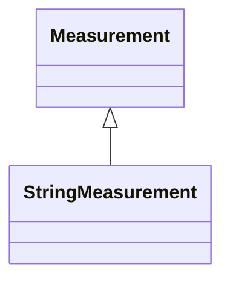

# StringMeasurement

StringMeasurement represents a measurement with values of type string.

## Inheritance

<button class="mermaid-enlarge-button">Enlarge Diagram</button>

## Attributes

| Label | Type | Multiplicity | Comment |
|-------|------|--------------|---------|
| StringMeasurementValues | [StringMeasurementValue](StringMeasurementValue.md) | 0..n | The values connected to this measurement. |

