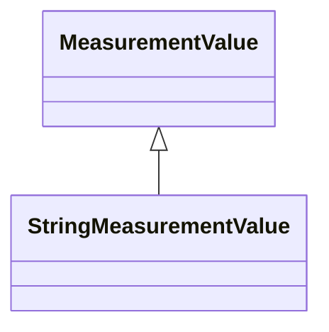

# StringMeasurementValue

StringMeasurementValue represents a measurement value of type string.

## Inheritance

<button class="mermaid-enlarge-button">Enlarge Diagram</button>

## Attributes

| Label | Type | Multiplicity | Comment |
|-------|------|--------------|---------|
| StringMeasurement | [StringMeasurement](StringMeasurement.md) | 1 | Measurement to which this value is connected. |

