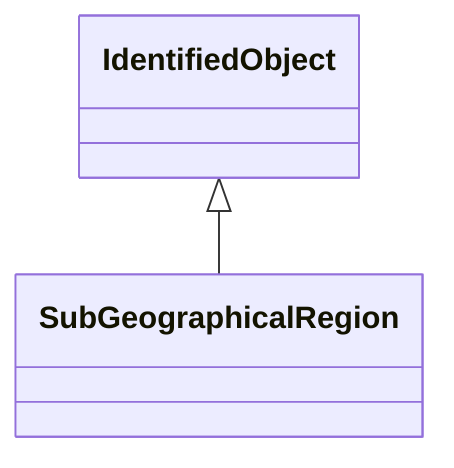

# SubGeographicalRegion

A subset of a geographical region of a power system network model.

## Inheritance

<button class="mermaid-enlarge-button">Enlarge Diagram</button>

## Attributes

| Label | Type | Multiplicity | Comment |
|-------|------|--------------|---------|
| DCLines | [DCLine](DCLine.md) | 0..n | The DC lines in this sub-geographical region. |
| Lines | [Line](Line.md) | 0..n | The lines within the sub-geographical region. |
| Region | [GeographicalRegion](GeographicalRegion.md) | 1 | The geographical region which this sub-geographical region is within. |
| Substations | [Substation](Substation.md) | 0..n | The substations in this sub-geographical region. |

