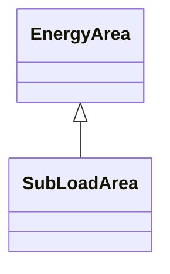

# SubLoadArea

The class is the second level in a hierarchical structure for grouping of loads for the purpose of load flow load scaling.

## Inheritance

<button class="mermaid-enlarge-button">Enlarge Diagram</button>

## Attributes

| Label | Type | Multiplicity | Comment |
|-------|------|--------------|---------|
| LoadArea | [LoadArea](LoadArea.md) | 1 | The LoadArea where the SubLoadArea belongs. |
| LoadGroups | [LoadGroup](LoadGroup.md) | 1..n | The Loadgroups in the SubLoadArea. |

