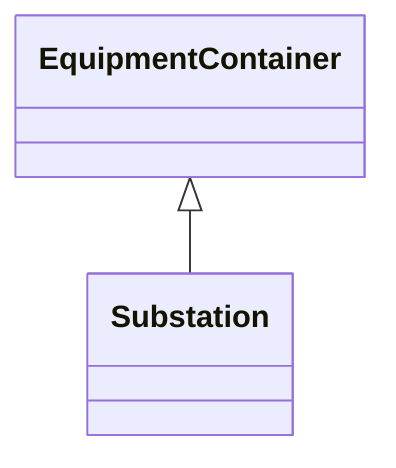

# Substation

A collection of equipment for purposes other than generation or utilization, through which electric energy in bulk is passed for the purposes of switching or modifying its characteristics.

## Inheritance

<button class="mermaid-enlarge-button">Enlarge Diagram</button>

## Attributes

| Label | Type | Multiplicity | Comment |
|-------|------|--------------|---------|
| DCConverterUnit | [DCConverterUnit](DCConverterUnit.md) | 0..n | The DC converter unit belonging of the substation. |
| Region | [SubGeographicalRegion](SubGeographicalRegion.md) | 1 | The SubGeographicalRegion containing the substation. |
| VoltageLevels | [VoltageLevel](VoltageLevel.md) | 0..n | The voltage levels within this substation. |

