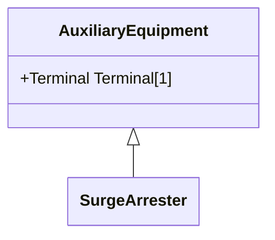

# SurgeArrester

Shunt device, installed on the network, usually in the proximity of electrical equipment in order to protect the said equipment against transient voltage transients caused by lightning or switching activity.

## Inheritance

<button class="mermaid-enlarge-button">Enlarge Diagram</button>

## Attributes

| Label | Type | Multiplicity | Comment |
|-------|------|--------------|---------|
| No attributes | | | |

