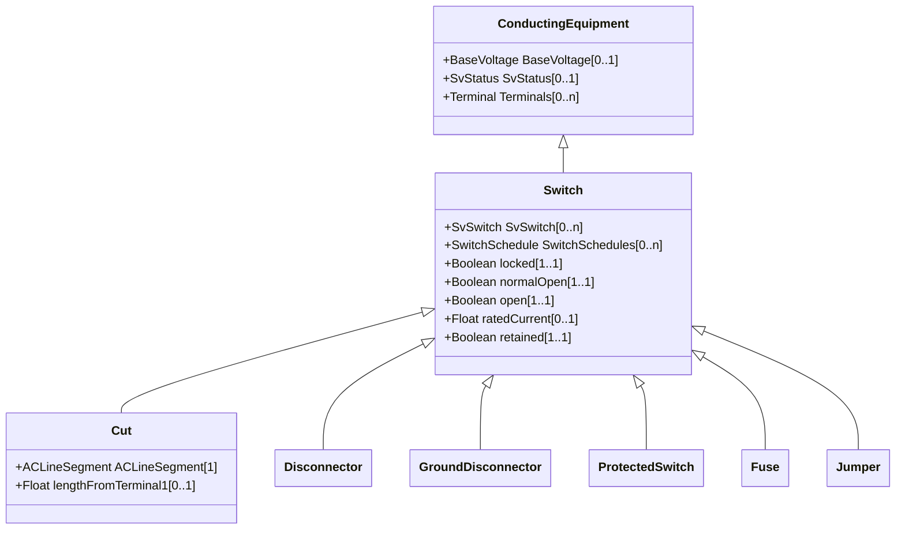

# Switch

A generic device designed to close, or open, or both, one or more electric circuits. All switches are two terminal devices including grounding switches. The ACDCTerminal.connected at the two sides of the switch shall not be considered for assessing switch connectivity, i.e. only Switch.open, .normalOpen and .locked are relevant.

## Inheritance

<button class="mermaid-enlarge-button">Enlarge Diagram</button>

## Attributes

| Label | Type | Multiplicity | Comment |
|-------|------|--------------|---------|
| SvSwitch | [SvSwitch](SvSwitch.md) | 0..n | The switch state associated with the switch. |
| SwitchSchedules | [SwitchSchedule](SwitchSchedule.md) | 0..n | A Switch can be associated with SwitchSchedules. |
| locked | Boolean | 1..1 | If true, the switch is locked. The resulting switch state is a combination of locked and Switch.open attributes as follows: locked=true and Switch.open=true. The resulting state is open and locked; locked=false and Switch.open=true. The resulting state is open; locked=false and Switch.open=false. The resulting state is closed. |
| normalOpen | Boolean | 1..1 | The attribute is used in cases when no Measurement for the status value is present. If the Switch has a status measurement the Discrete.normalValue is expected to match with the Switch.normalOpen. |
| open | Boolean | 1..1 | The attribute tells if the switch is considered open when used as input to topology processing. |
| ratedCurrent | Float | 0..1 | The maximum continuous current carrying capacity in amps governed by the device material and construction. The attribute shall be a positive value. |
| retained | Boolean | 1..1 | Branch is retained in the topological solution. The flow through retained switches will normally be calculated in power flow. |

