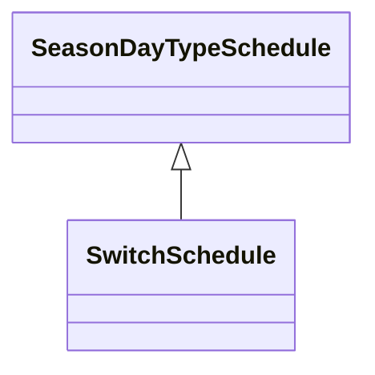

# SwitchSchedule

A schedule of switch positions. If RegularTimePoint.value1 is 0, the switch is open. If 1, the switch is closed.

## Inheritance

<button class="mermaid-enlarge-button">Enlarge Diagram</button>

## Attributes

| Label | Type | Multiplicity | Comment |
|-------|------|--------------|---------|
| Switch | [Switch](Switch.md) | 1 | A SwitchSchedule is associated with a Switch. |

