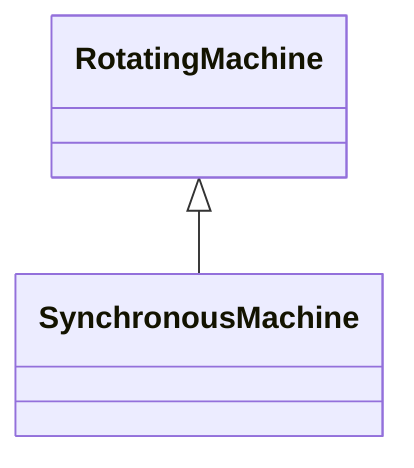

# SynchronousMachine

An electromechanical device that operates with shaft rotating synchronously with the network. It is a single machine operating either as a generator or synchronous condenser or pump.

## Inheritance

<button class="mermaid-enlarge-button">Enlarge Diagram</button>

## Attributes

| Label | Type | Multiplicity | Comment |
|-------|------|--------------|---------|
| InitialReactiveCapabilityCurve | [ReactiveCapabilityCurve](ReactiveCapabilityCurve.md) | 0..1 | The default reactive capability curve for use by a synchronous machine. |
| SynchronousMachineDynamics | [SynchronousMachineDynamics](SynchronousMachineDynamics.md) | 0..1 | Synchronous machine dynamics model used to describe dynamic behaviour of this synchronous machine. |
| earthing | Boolean | 1..1 | Indicates whether or not the generator is earthed. Used for short circuit data exchange according to IEC 60909. |
| earthingStarPointR | Float | 0..1 | Generator star point earthing resistance (Re). Used for short circuit data exchange according to IEC 60909. |
| earthingStarPointX | Float | 0..1 | Generator star point earthing reactance (Xe). Used for short circuit data exchange according to IEC 60909. |
| ikk | Float | 0..1 | Steady-state short-circuit current (in A for the profile) of generator with compound excitation during 3-phase short circuit. - Ikk=0: Generator with no compound excitation. - Ikk<>0: Generator with compound excitation. Ikk is used to calculate the minimum steady-state short-circuit current for generators with compound excitation. (4.6.1.2 in IEC 60909-0:2001). Used only for single fed short circuit on a generator. (4.3.4.2. in IEC 60909-0:2001). |
| maxQ | Float | 0..1 | Maximum reactive power limit. This is the maximum (nameplate) limit for the unit. |
| minQ | Float | 0..1 | Minimum reactive power limit for the unit. |
| mu | Float | 0..1 | Factor to calculate the breaking current (Section 4.5.2.1 in IEC 60909-0). Used only for single fed short circuit on a generator (Section 4.3.4.2. in IEC 60909-0). |
| operatingMode | [SynchronousMachineOperatingMode](SynchronousMachineOperatingMode.md) | 1..1 | Current mode of operation. |
| qPercent | Float | 0..1 | Part of the coordinated reactive control that comes from this machine. The attribute is used as a participation factor not necessarily summing up to 100% for the participating devices in the control. |
| r | Float | 1..1 | Equivalent resistance (RG) of generator. RG is considered for the calculation of all currents, except for the calculation of the peak current ip. Used for short circuit data exchange according to IEC 60909. |
| r0 | Float | 1..1 | Zero sequence resistance of the synchronous machine. |
| r2 | Float | 1..1 | Negative sequence resistance. |
| referencePriority | Integer | 1..1 | Priority of unit for use as powerflow voltage phase angle reference bus selection. 0 = don t care (default) 1 = highest priority. 2 is less than 1 and so on. |
| satDirectSubtransX | Float | 1..1 | Direct-axis subtransient reactance saturated, also known as Xd'sat. |
| satDirectSyncX | Float | 0..1 | Direct-axes saturated synchronous reactance (xdsat); reciprocal of short-circuit ration. Used for short circuit data exchange, only for single fed short circuit on a generator. (4.3.4.2. in IEC 60909-0:2001). |
| satDirectTransX | Float | 0..1 | Saturated Direct-axis transient reactance. The attribute is primarily used for short circuit calculations according to ANSI. |
| shortCircuitRotorType | [ShortCircuitRotorKind](ShortCircuitRotorKind.md) | 0..1 | Type of rotor, used by short circuit applications, only for single fed short circuit according to IEC 60909. |
| type | [SynchronousMachineKind](SynchronousMachineKind.md) | 1..1 | Modes that this synchronous machine can operate in. |
| voltageRegulationRange | Float | 0..1 | Range of generator voltage regulation (PG in IEC 60909-0) used for calculation of the impedance correction factor KG defined in IEC 60909-0. This attribute is used to describe the operating voltage of the generating unit. |
| x0 | Float | 1..1 | Zero sequence reactance of the synchronous machine. |
| x2 | Float | 1..1 | Negative sequence reactance. |

