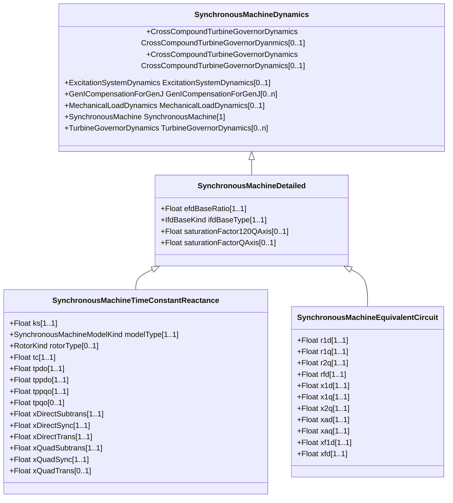

# SynchronousMachineDetailed

All synchronous machine detailed types use a subset of the same data parameters and input/output variables. The several variations differ in the following ways: - the number of equivalent windings that are included; - the way in which saturation is incorporated into the model; - whether or not “subtransient saliency” (X''q not = X''d) is represented. It is not necessary for each simulation tool to have separate models for each of the model types. The same model can often be used for several types by alternative logic within the model. Also, differences in saturation representation might not result in significant model performance differences so model substitutions are often acceptable.

## Inheritance

<button class="mermaid-enlarge-button">Enlarge Diagram</button>

## Attributes

| Label | Type | Multiplicity | Comment |
|-------|------|--------------|---------|
| efdBaseRatio | Float | 1..1 | Ratio (exciter voltage/generator voltage) of Efd bases of exciter and generator models (> 0). Typical value = 1. |
| ifdBaseType | [IfdBaseKind](IfdBaseKind.md) | 1..1 | Excitation base system mode. It should be equal to the value of WLMDV given by the user. WLMDV is the PU ratio between the field voltage and the excitation current: Efd = WLMDV x Ifd. Typical value = ifag. |
| saturationFactor120QAxis | Float | 0..1 | Quadrature-axis saturation factor at 120% of rated terminal voltage (S12q) (>= SynchonousMachineDetailed.saturationFactorQAxis). Typical value = 0,12. |
| saturationFactorQAxis | Float | 0..1 | Quadrature-axis saturation factor at rated terminal voltage (S1q) (>= 0). Typical value = 0,02. |

