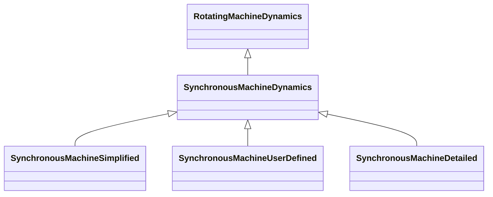

# SynchronousMachineDynamics

Synchronous machine whose behaviour is described by reference to a standard model expressed in one of the following forms: - simplified (or classical), where a group of generators or motors is not modelled in detail; - detailed, in equivalent circuit form; - detailed, in time constant reactance form; or - by definition of a user-defined model. It is a common practice to represent small generators by a negative load rather than by a dynamic generator model when performing dynamics simulations. In this case, a SynchronousMachine in the static model is not represented by anything in the dynamics model, instead it is treated as an ordinary load. Parameter details: Synchronous machine parameters such as Xl, Xd, Xp etc. are actually used as inductances in the models, but are commonly referred to as reactances since, at nominal frequency, the PU values are the same. However, some references use the symbol L instead of X.

## Inheritance

<button class="mermaid-enlarge-button">Enlarge Diagram</button>

## Attributes

| Label | Type | Multiplicity | Comment |
|-------|------|--------------|---------|
| CrossCompoundTurbineGovernorDyanmics | [CrossCompoundTurbineGovernorDynamics](CrossCompoundTurbineGovernorDynamics.md) | 0..1 | The cross-compound turbine governor with which this high-pressure synchronous machine is associated. |
| CrossCompoundTurbineGovernorDynamics | [CrossCompoundTurbineGovernorDynamics](CrossCompoundTurbineGovernorDynamics.md) | 0..1 | The cross-compound turbine governor with which this low-pressure synchronous machine is associated. |
| ExcitationSystemDynamics | [ExcitationSystemDynamics](ExcitationSystemDynamics.md) | 0..1 | Excitation system model associated with this synchronous machine model. |
| GenICompensationForGenJ | [GenICompensationForGenJ](GenICompensationForGenJ.md) | 0..n | Compensation of voltage compensator's generator for current flow out of this generator. |
| MechanicalLoadDynamics | [MechanicalLoadDynamics](MechanicalLoadDynamics.md) | 0..1 | Mechanical load model associated with this synchronous machine model. |
| SynchronousMachine | [SynchronousMachine](SynchronousMachine.md) | 1 | Synchronous machine to which synchronous machine dynamics model applies. |
| TurbineGovernorDynamics | [TurbineGovernorDynamics](TurbineGovernorDynamics.md) | 0..n | Turbine-governor model associated with this synchronous machine model. Multiplicity of greater than one is intended to support hydro units that have multiple turbines on one generator. |

