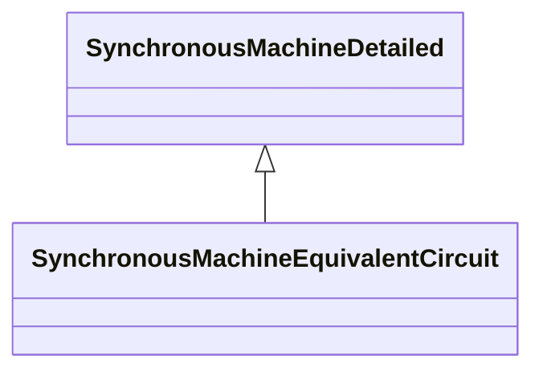

# SynchronousMachineEquivalentCircuit

The electrical equations for all variations of the synchronous models are based on the SynchronousEquivalentCircuit diagram for the direct- and quadrature- axes. Equations for conversion between equivalent circuit and time constant reactance forms: Xd = Xad + Xl X’d = Xl + Xad x Xfd / (Xad + Xfd) X”d = Xl + Xad x Xfd x X1d / (Xad x Xfd + Xad x X1d + Xfd x X1d) Xq = Xaq + Xl X’q = Xl + Xaq x X1q / (Xaq + X1q) X”q = Xl + Xaq x X1q x X2q / (Xaq x X1q + Xaq x X2q + X1q x X2q) T’do = (Xad + Xfd) / (omega0 x Rfd) T”do = (Xad x Xfd + Xad x X1d + Xfd x X1d) / (omega0 x R1d x (Xad + Xfd) T’qo = (Xaq + X1q) / (omega0 x R1q) T”qo = (Xaq x X1q + Xaq x X2q + X1q x X2q) / (omega0 x R2q x (Xaq + X1q) Same equations using CIM attributes from SynchronousMachineTimeConstantReactance class on left of '=' and SynchronousMachineEquivalentCircuit class on right (except as noted): xDirectSync = xad + RotatingMachineDynamics.statorLeakageReactance xDirectTrans = RotatingMachineDynamics.statorLeakageReactance + xad x xfd / (xad + xfd) xDirectSubtrans = RotatingMachineDynamics.statorLeakageReactance + xad x xfd x x1d / (xad x xfd + xad x x1d + xfd x x1d) xQuadSync = xaq + RotatingMachineDynamics.statorLeakageReactance xQuadTrans = RotatingMachineDynamics.statorLeakageReactance + xaq x x1q / (xaq+ x1q) xQuadSubtrans = RotatingMachineDynamics.statorLeakageReactance + xaq x x1q x x2q / (xaq x x1q + xaq x x2q + x1q x x2q) tpdo = (xad + xfd) / (2 x pi x nominal frequency x rfd) tppdo = (xad x xfd + xad x x1d + xfd x x1d) / (2 x pi x nominal frequency x r1d x (xad + xfd) tpqo = (xaq + x1q) / (2 x pi x nominal frequency x r1q) tppqo = (xaq x x1q + xaq x x2q + x1q x x2q) / (2 x pi x nominal frequency x r2q x (xaq + x1q) These are only valid for a simplified model where 'Canay' reactance is zero.

## Inheritance

<button class="mermaid-enlarge-button">Enlarge Diagram</button>

## Attributes

| Label | Type | Multiplicity | Comment |
|-------|------|--------------|---------|
| r1d | Float | 1..1 | Direct-axis damper 1 winding resistance. |
| r1q | Float | 1..1 | Quadrature-axis damper 1 winding resistance. |
| r2q | Float | 1..1 | Quadrature-axis damper 2 winding resistance. |
| rfd | Float | 1..1 | Field winding resistance. |
| x1d | Float | 1..1 | Direct-axis damper 1 winding leakage reactance. |
| x1q | Float | 1..1 | Quadrature-axis damper 1 winding leakage reactance. |
| x2q | Float | 1..1 | Quadrature-axis damper 2 winding leakage reactance. |
| xad | Float | 1..1 | Direct-axis mutual reactance. |
| xaq | Float | 1..1 | Quadrature-axis mutual reactance. |
| xf1d | Float | 1..1 | Differential mutual (“Canay”) reactance. |
| xfd | Float | 1..1 | Field winding leakage reactance. |

