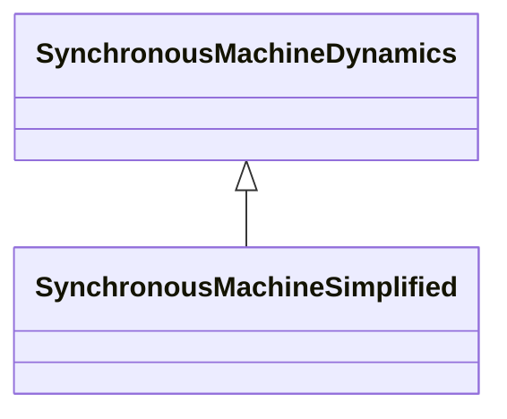

# SynchronousMachineSimplified

The simplified model represents a synchronous generator as a constant internal voltage behind an impedance (Rs + jXp) as shown in the Simplified diagram. Since internal voltage is held constant, there is no Efd input and any excitation system model will be ignored. There is also no Ifd output. This model should not be used for representing a real generator except, perhaps, small generators whose response is insignificant. The parameters used for the simplified model include: - RotatingMachineDynamics.damping (D); - RotatingMachineDynamics.inertia (H); - RotatingMachineDynamics.statorLeakageReactance (used to exchange jXp for SynchronousMachineSimplified); - RotatingMachineDynamics.statorResistance (Rs).

## Inheritance

<button class="mermaid-enlarge-button">Enlarge Diagram</button>

## Attributes

| Label | Type | Multiplicity | Comment |
|-------|------|--------------|---------|
| No attributes | | | |

