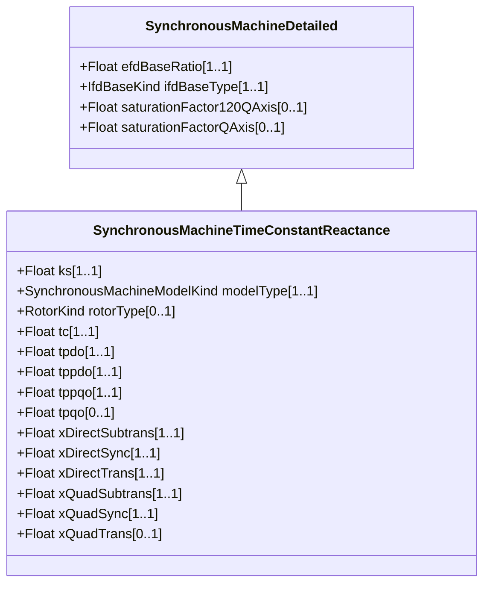

# SynchronousMachineTimeConstantReactance

Synchronous machine detailed modelling types are defined by the combination of the attributes SynchronousMachineTimeConstantReactance.modelType and SynchronousMachineTimeConstantReactance.rotorType. Parameter details: The “p” in the time-related attribute names is a substitution for a “prime” in the usual parameter notation, e.g. tpdo refers to T'do. The parameters used for models expressed in time constant reactance form include: - RotatingMachine.ratedS (MVAbase); - RotatingMachineDynamics.damping (D); - RotatingMachineDynamics.inertia (H); - RotatingMachineDynamics.saturationFactor (S1); - RotatingMachineDynamics.saturationFactor120 (S12); - RotatingMachineDynamics.statorLeakageReactance (Xl); - RotatingMachineDynamics.statorResistance (Rs); - SynchronousMachineTimeConstantReactance.ks (Ks); - SynchronousMachineDetailed.saturationFactorQAxis (S1q); - SynchronousMachineDetailed.saturationFactor120QAxis (S12q); - SynchronousMachineDetailed.efdBaseRatio; - SynchronousMachineDetailed.ifdBaseType; - .xDirectSync (Xd); - .xDirectTrans (X'd); - .xDirectSubtrans (X''d); - .xQuadSync (Xq); - .xQuadTrans (X'q); - .xQuadSubtrans (X''q); - .tpdo (T'do); - .tppdo (T''do); - .tpqo (T'qo); - .tppqo (T''qo); - .tc.

## Inheritance

<button class="mermaid-enlarge-button">Enlarge Diagram</button>

## Attributes

| Label | Type | Multiplicity | Comment |
|-------|------|--------------|---------|
| ks | Float | 1..1 | Saturation loading correction factor (Ks) (>= 0). Used only by type J model. Typical value = 0. |
| modelType | [SynchronousMachineModelKind](SynchronousMachineModelKind.md) | 1..1 | Type of synchronous machine model used in dynamic simulation applications. |
| rotorType | [RotorKind](RotorKind.md) | 0..1 | Type of rotor on physical machine. |
| tc | Float | 1..1 | Damping time constant for “Canay” reactance (>= 0). Typical value = 0. |
| tpdo | Float | 1..1 | Direct-axis transient rotor time constant (T'do) (> SynchronousMachineTimeConstantReactance.tppdo). Typical value = 5. |
| tppdo | Float | 1..1 | Direct-axis subtransient rotor time constant (T''do) (> 0). Typical value = 0,03. |
| tppqo | Float | 1..1 | Quadrature-axis subtransient rotor time constant (T''qo) (> 0). Typical value = 0,03. |
| tpqo | Float | 0..1 | Quadrature-axis transient rotor time constant (T'qo) (> SynchronousMachineTimeConstantReactance.tppqo). Typical value = 0,5. |
| xDirectSubtrans | Float | 1..1 | Direct-axis subtransient reactance (unsaturated) (X''d) (> RotatingMachineDynamics.statorLeakageReactance). Typical value = 0,2. |
| xDirectSync | Float | 1..1 | Direct-axis synchronous reactance (Xd) (>= SynchronousMachineTimeConstantReactance.xDirectTrans). The quotient of a sustained value of that AC component of armature voltage that is produced by the total direct-axis flux due to direct-axis armature current and the value of the AC component of this current, the machine running at rated speed. Typical value = 1,8. |
| xDirectTrans | Float | 1..1 | Direct-axis transient reactance (unsaturated) (X'd) (>= SynchronousMachineTimeConstantReactance.xDirectSubtrans). Typical value = 0,5. |
| xQuadSubtrans | Float | 1..1 | Quadrature-axis subtransient reactance (X''q) (> RotatingMachineDynamics.statorLeakageReactance). Typical value = 0,2. |
| xQuadSync | Float | 1..1 | Quadrature-axis synchronous reactance (Xq) (>= SynchronousMachineTimeConstantReactance.xQuadTrans). The ratio of the component of reactive armature voltage, due to the quadrature-axis component of armature current, to this component of current, under steady state conditions and at rated frequency. Typical value = 1,6. |
| xQuadTrans | Float | 0..1 | Quadrature-axis transient reactance (X'q) (>= SynchronousMachineTimeConstantReactance.xQuadSubtrans). Typical value = 0,3. |

