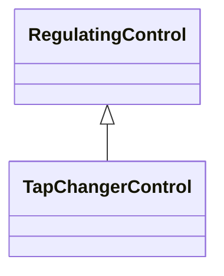

# TapChangerControl

Describes behaviour specific to tap changers, e.g. how the voltage at the end of a line varies with the load level and compensation of the voltage drop by tap adjustment.

## Inheritance

<button class="mermaid-enlarge-button">Enlarge Diagram</button>

## Attributes

| Label | Type | Multiplicity | Comment |
|-------|------|--------------|---------|
| TapChanger | [TapChanger](TapChanger.md) | 1..n | The tap changers that participates in this regulating tap control scheme. |

