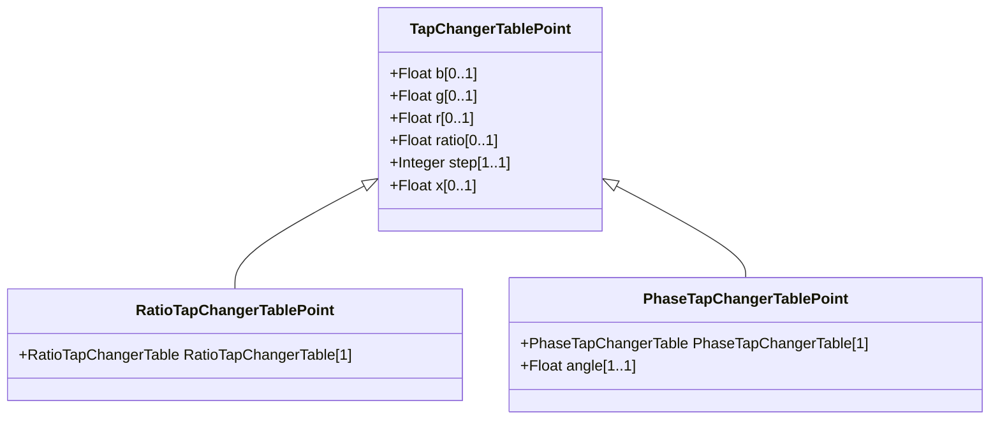

# TapChangerTablePoint

Describes each tap step in the tabular curve.

## Inheritance

<button class="mermaid-enlarge-button">Enlarge Diagram</button>

## Attributes

| Label | Type | Multiplicity | Comment |
|-------|------|--------------|---------|
| b | Float | 0..1 | The magnetizing branch susceptance deviation as a percentage of nominal value. The actual susceptance is calculated as follows: calculated magnetizing susceptance = b(nominal) * (1 + b(from this class)/100). The b(nominal) is defined as the static magnetizing susceptance on the associated power transformer end or ends. This model assumes the star impedance (pi model) form. |
| g | Float | 0..1 | The magnetizing branch conductance deviation as a percentage of nominal value. The actual conductance is calculated as follows: calculated magnetizing conductance = g(nominal) * (1 + g(from this class)/100). The g(nominal) is defined as the static magnetizing conductance on the associated power transformer end or ends. This model assumes the star impedance (pi model) form. |
| r | Float | 0..1 | The resistance deviation as a percentage of nominal value. The actual reactance is calculated as follows: calculated resistance = r(nominal) * (1 + r(from this class)/100). The r(nominal) is defined as the static resistance on the associated power transformer end or ends. This model assumes the star impedance (pi model) form. |
| ratio | Float | 0..1 | The voltage at the tap step divided by rated voltage of the transformer end having the tap changer. Hence this is a value close to one. For example, if the ratio at step 1 is 1.01, and the rated voltage of the transformer end is 110kV, then the voltage obtained by setting the tap changer to step 1 to is 111.1kV. |
| step | Integer | 1..1 | The tap step. |
| x | Float | 0..1 | The series reactance deviation as a percentage of nominal value. The actual reactance is calculated as follows: calculated reactance = x(nominal) * (1 + x(from this class)/100). The x(nominal) is defined as the static series reactance on the associated power transformer end or ends. This model assumes the star impedance (pi model) form. |

