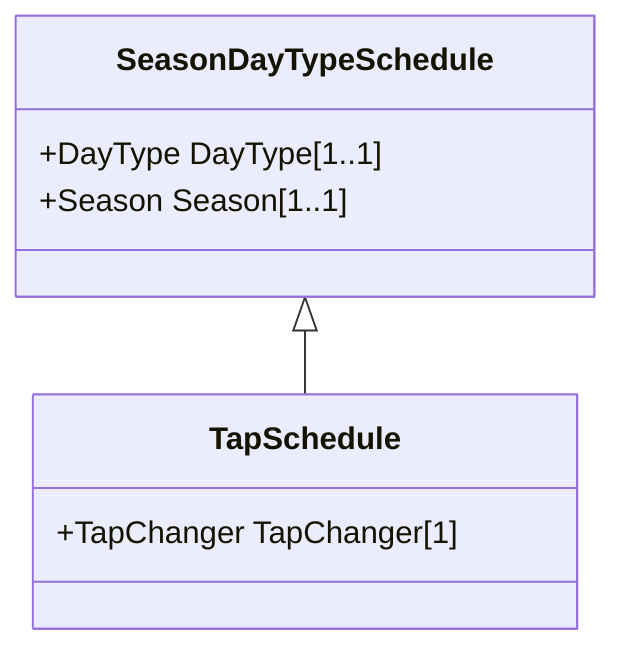

# TapSchedule

A pre-established pattern over time for a tap step.

## Inheritance

<button class="mermaid-enlarge-button">Enlarge Diagram</button>

## Attributes

| Label | Type | Multiplicity | Comment |
|-------|------|--------------|---------|
| TapChanger | [TapChanger](TapChanger.md) | 1 | A TapSchedule is associated with a TapChanger. |

