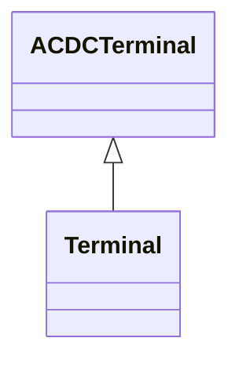

# Terminal

An AC electrical connection point to a piece of conducting equipment. Terminals are connected at physical connection points called connectivity nodes.

## Inheritance

<button class="mermaid-enlarge-button">Enlarge Diagram</button>

## Attributes

| Label | Type | Multiplicity | Comment |
|-------|------|--------------|---------|
| AuxiliaryEquipment | [AuxiliaryEquipment](AuxiliaryEquipment.md) | 0..n | The auxiliary equipment connected to the terminal. |
| ConductingEquipment | [ConductingEquipment](ConductingEquipment.md) | 1 | The conducting equipment of the terminal. Conducting equipment have terminals that may be connected to other conducting equipment terminals via connectivity nodes or topological nodes. |
| ConnectivityNode | [ConnectivityNode](ConnectivityNode.md) | 0..1 | The connectivity node to which this terminal connects with zero impedance. |
| ConverterDCSides | [ACDCConverter](ACDCConverter.md) | 0..n | All converters' DC sides linked to this point of common coupling terminal. |
| HasFirstMutualCoupling | [MutualCoupling](MutualCoupling.md) | 0..n | Mutual couplings associated with the branch as the first branch. |
| HasSecondMutualCoupling | [MutualCoupling](MutualCoupling.md) | 0..n | Mutual couplings with the branch associated as the first branch. |
| RegulatingControl | [RegulatingControl](RegulatingControl.md) | 0..n | The controls regulating this terminal. |
| RemoteInputSignal | [RemoteInputSignal](RemoteInputSignal.md) | 0..n | Input signal coming from this terminal. |
| SvPowerFlow | [SvPowerFlow](SvPowerFlow.md) | 0..1 | The power flow state variable associated with the terminal. |
| TieFlow | [TieFlow](TieFlow.md) | 0..2 | The control area tie flows to which this terminal associates. |
| TopologicalNode | [TopologicalNode](TopologicalNode.md) | 0..1 | The topological node associated with the terminal. This can be used as an alternative to the connectivity node path to topological node, thus making it unnecessary to model connectivity nodes in some cases. Note that the if connectivity nodes are in the model, this association would probably not be used as an input specification. |
| TransformerEnd | [TransformerEnd](TransformerEnd.md) | 0..n | All transformer ends connected at this terminal. |
| phases | [PhaseCode](PhaseCode.md) | 0..1 | Represents the normal network phasing condition. If the attribute is missing, three phases (ABC) shall be assumed, except for terminals of grounding classes (specializations of EarthFaultCompensator, GroundDisconnector, and Ground) which will be assumed to be N. Therefore, phase code ABCN is explicitly declared when needed, e.g. for star point grounding equipment. The phase code on terminals connecting same ConnectivityNode or same TopologicalNode as well as for equipment between two terminals shall be consistent. |

