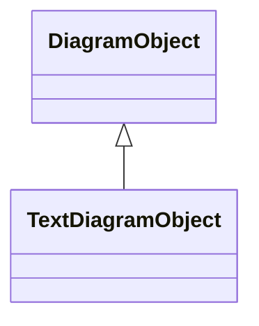

# TextDiagramObject

A diagram object for placing free-text or text derived from an associated domain object.

## Inheritance

<button class="mermaid-enlarge-button">Enlarge Diagram</button>

## Attributes

| Label | Type | Multiplicity | Comment |
|-------|------|--------------|---------|
| text | String | 1..1 | The text that is displayed by this text diagram object. |

