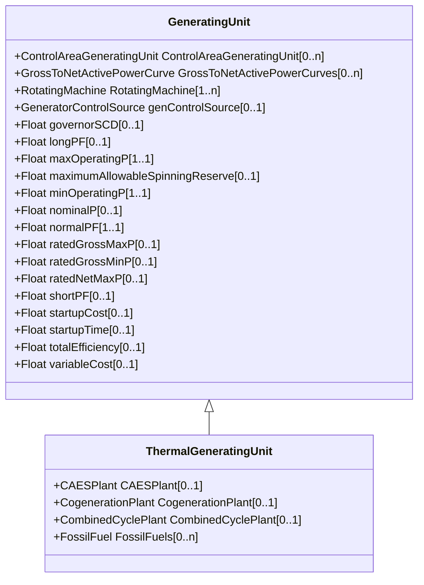

# ThermalGeneratingUnit

A generating unit whose prime mover could be a steam turbine, combustion turbine, or diesel engine.

## Inheritance

<button class="mermaid-enlarge-button">Enlarge Diagram</button>

## Attributes

| Label | Type | Multiplicity | Comment |
|-------|------|--------------|---------|
| CAESPlant | [CAESPlant](CAESPlant.md) | 0..1 | A thermal generating unit may be a member of a compressed air energy storage plant. |
| CogenerationPlant | [CogenerationPlant](CogenerationPlant.md) | 0..1 | A thermal generating unit may be a member of a cogeneration plant. |
| CombinedCyclePlant | [CombinedCyclePlant](CombinedCyclePlant.md) | 0..1 | A thermal generating unit may be a member of a combined cycle plant. |
| FossilFuels | [FossilFuel](FossilFuel.md) | 0..n | A thermal generating unit may have one or more fossil fuels. |

